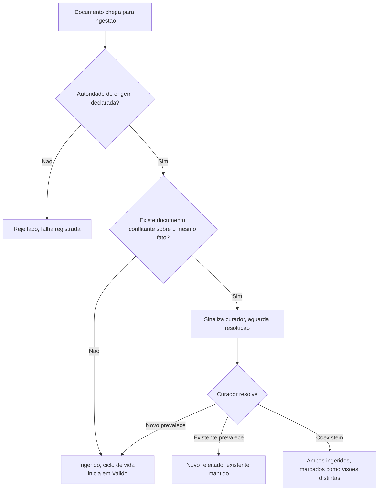

# Fluxogramas

O nó `D` é o que distingue este processo de ingestão simples: nenhum documento entra na base sem
essa checagem, mesmo quando parece óbvio que não há conflito — a checagem estrutural substitui a
suposição, porque conflito não detectado a tempo é o que produz resposta contraditória meses
depois, quando ninguém mais lembra que os dois documentos coexistiam.

## O caminho que não deveria existir

Documento que entra direto em `E` sem passar por `D` — porque alguém decidiu "isso não pode
conflitar com nada" sem verificar — é o atalho mais provável de ser tomado sob pressão de prazo, e
é exatamente o que a auditoria de conflito existe para impedir estruturalmente, não só por
disciplina de quem opera o pipeline.

## Onde a pressão de prazo mais aparece

Na prática observada em pipelines reais, o nó `D` (checagem de conflito) é o primeiro a ser
pulado sob pressão de prazo, porque parece opcional quando o volume de documentos é pequeno.
A checagem custa pouco por documento individual e o custo de pulá-la só aparece meses depois,
quando a base já tem dezenas de conflitos não detectados acumulados — daí a regra não distinguir
"poucos documentos" de "muitos" ao se aplicar: o custo futuro de pular a checagem cresce junto
com o volume, mas a tentação de pular também cresce, na direção errada, exatamente quando o
volume de documentos começa a parecer grande demais para revisar um a um manualmente.
