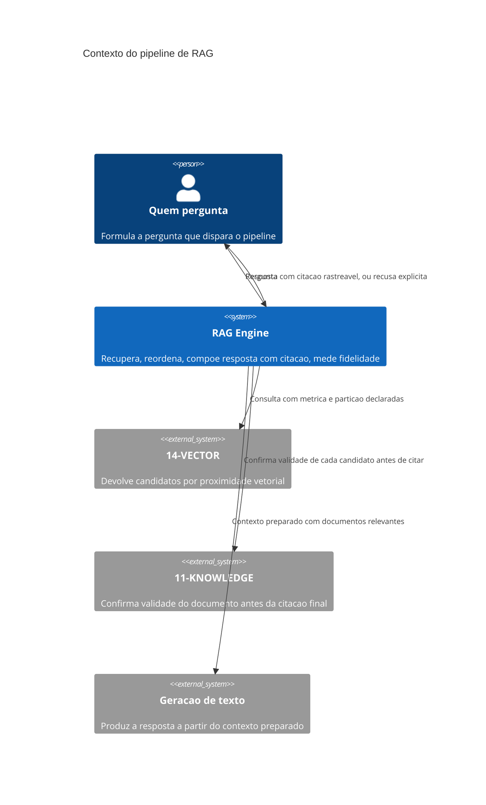

# Arquitetura

O pipeline consulta `14-VECTOR` primeiro (candidatos por proximidade), depois `11-KNOWLEDGE`
(confirma que cada candidato ainda é válido — um documento pode ter expirado entre a indexação e
a consulta), e só então prepara o contexto para geração. A ordem importa: confirmar validade
depois de recuperar, não antes, porque a recuperação já filtra pelo espaço vetorial correto, e
confirmar validade de todo o índice antes de qualquer busca seria trabalho desperdiçado sobre
documentos que nunca seriam candidatos de qualquer forma.

## Componentes

O **recuperador** consulta o índice e devolve N candidatos por proximidade. O **reordenador**
aplica critério de relevância à pergunta específica sobre os candidatos, produzindo um subconjunto
menor e mais preciso. O **verificador de validade** confirma, para cada candidato que sobrevive à
reordenação, que o documento continua válido em `11-KNOWLEDGE` — candidato expirado é descartado
aqui, não antes. O **compositor de resposta** monta o contexto final com citação rastreável, e o
**medidor de fidelidade** avalia, depois da geração, se a resposta de fato se sustenta no que foi
citado.

## Por que confirmar validade não acontece antes da reordenação

Confirmar validade de todo candidato recuperado, antes de reordenar, gastaria a chamada a
`11-KNOWLEDGE` em candidatos que a reordenação descartaria de qualquer forma por baixa
relevância. Fazer a checagem depois da reordenação, só nos sobreviventes, é o que mantém o custo
de confirmação proporcional ao que de fato importa para a resposta final, não ao total de
candidatos brutos recuperados.
