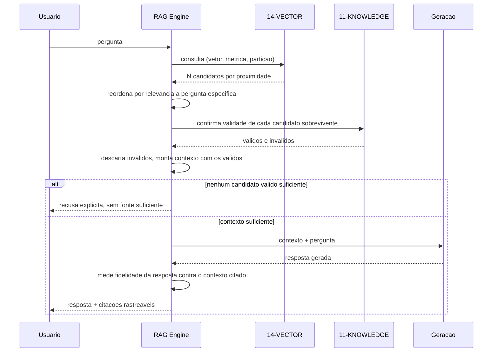
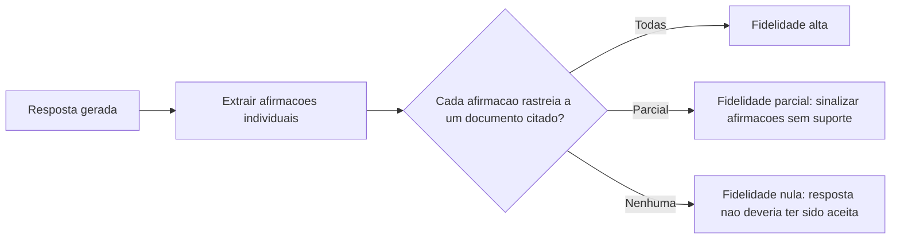

# Diagramas

O ramo de recusa explícita não é caso de erro — é resultado legítimo do pipeline, tão válido
quanto uma resposta bem-sucedida. Tratá-lo como exceção a ser evitada a qualquer custo é o que
leva sistemas de RAG a gerar resposta plausível sem fundamento quando a base não tem informação
suficiente.

## Medição de fidelidade

A medição acontece depois da geração, não antes — é uma verificação sobre o que o modelo de fato
produziu, não uma garantia embutida no processo de geração em si, que não tem como assegurar
fidelidade sozinho. Os três resultados possíveis (`D`, `E`, `F`) não são simétricos em
consequência: fidelidade alta entrega a resposta sem ressalva; fidelidade parcial entrega com
sinalização explícita das afirmações sem suporte, preservando o que é confiável; fidelidade nula
descarta a resposta inteira, porque nesse caso não há parte confiável o suficiente para preservar
— a diferença entre os três ramos é o que orienta a ação de quem opera o sistema quando a
fidelidade cai abaixo do esperado, não só um número agregado sem direção clara de correção.

## Por que fidelidade é medida como estado separado, não como parte de Gerando

Se a medição de fidelidade fosse parte do mesmo passo que gera a resposta, um bug na geração e um
bug na medição ficariam indistinguíveis no diagnóstico. Separar os dois em estados distintos do
`stateDiagram-v2` de `06-Fluxogramas.md` permite verificar cada um isoladamente: pode-se testar
`medir_fidelidade` sem nunca chamar geração real, usando resposta fixa como entrada.
