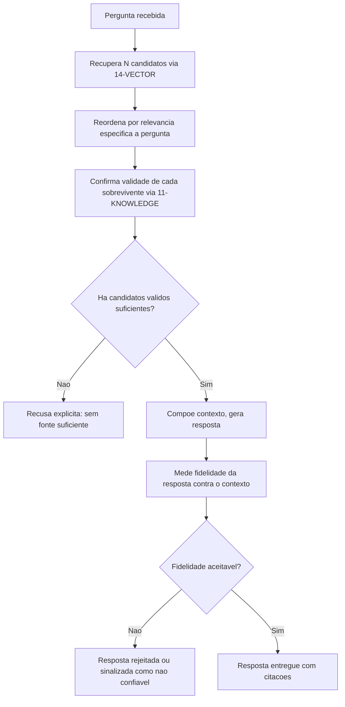
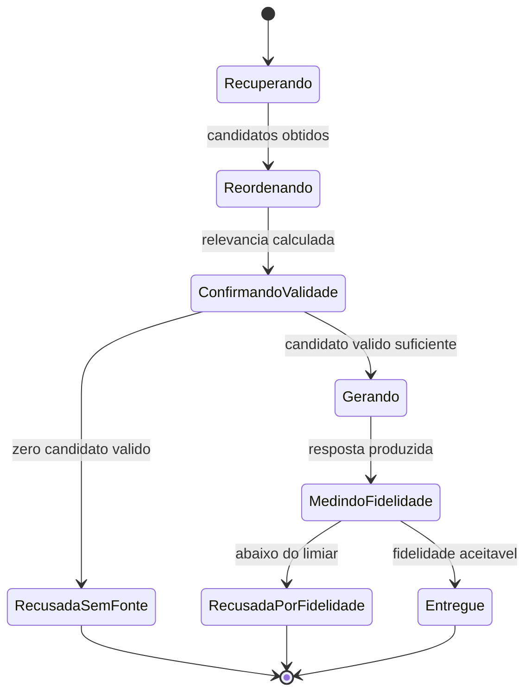

# Fluxogramas

Dois pontos de recusa existem no fluxo (`E` e `I`), e são propositalmente distintos: `E` recusa
por falta de fonte antes mesmo de gerar qualquer resposta; `I` recusa depois de gerar, porque a
geração produziu algo que não se sustenta no que foi citado, mesmo com fonte suficiente
disponível. Confundir os dois pontos de recusa esconde qual das duas causas está de fato
acontecendo quando o sistema não entrega resposta.

## O caminho que mais se ignora

Pular `D` (confirmar validade depois da reordenação) "porque o índice já garantiria isso" é um
erro sutil — `14-VECTOR` garante correção da busca vetorial, não validade de ciclo de vida do
documento, que é responsabilidade de `11-KNOWLEDGE` e pode ter mudado entre a indexação original
e o momento desta consulta específica.

## Estados de uma consulta ao longo do pipeline

Os dois estados de recusa (`RecusadaSemFonte`, `RecusadaPorFidelidade`) nunca se confundem no
diagrama, porque nascem de transições diferentes — a primeira sai de `ConfirmandoValidade`, antes
de qualquer geração acontecer; a segunda só é alcançável depois de `Gerando`, o que por si só já
documenta que a causa da recusa é posterior à existência de fonte válida. Um sistema de logs que
registra só "recusada: true/false" sem preservar de qual estado a recusa veio perde exatamente a
informação que esse diagrama existe para tornar visível.
