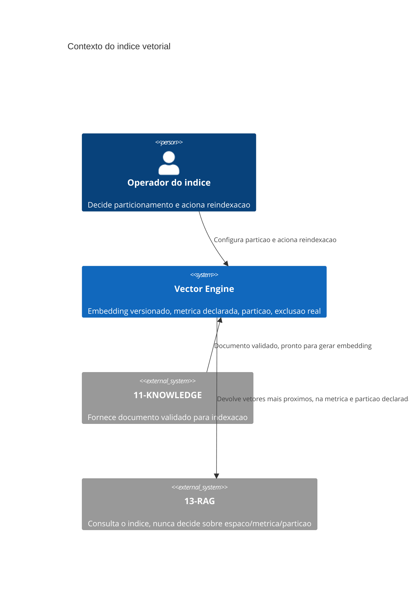

# Arquitetura

O índice recebe documento já validado por `11-KNOWLEDGE` — nunca gera embedding de documento que
não passou por curadoria. A consulta que `13-RAG` faz precisa declarar explicitamente a partição
e a métrica esperada; o índice recusa consulta sem essa declaração, em vez de assumir um padrão
implícito que poderia mascarar um erro de integração.

## Componentes

O **gerador de embedding versionado** associa cada vetor à versão do modelo que o produziu, e
essa versão nunca é omitida do vetor armazenado. O **comparador de métrica** aplica a métrica
declarada e recusa comparação entre vetores de métricas diferentes — não converte nem tenta
normalizar silenciosamente, porque conversão implícita entre métricas é fonte de erro sutil. O
**particionador** isola coleções não relacionadas em namespaces distintos, e uma consulta sem
partição declarada não tem padrão implícito — é rejeitada. O **gestor de exclusão** garante que
documento excluído nunca é devolvido, mesmo que a estrutura física do índice ainda não tenha
compactado o espaço ocupado por ele.

## Por que o índice recusa em vez de assumir

Um índice que aceitasse consulta sem métrica declarada teria duas opções ruins: assumir uma
métrica padrão silenciosamente, ou tentar detectar a métrica a partir do vetor de busca — nenhuma
das duas é confiável. A métrica não é propriedade do vetor de busca, é propriedade do espaço
vetorial inteiro, e só quem criou o índice sabe qual métrica foi usada para gerar os vetores
armazenados. Recusar a consulta é a única resposta que não arrisca produzir resultado sem
significado disfarçado de resultado válido.
