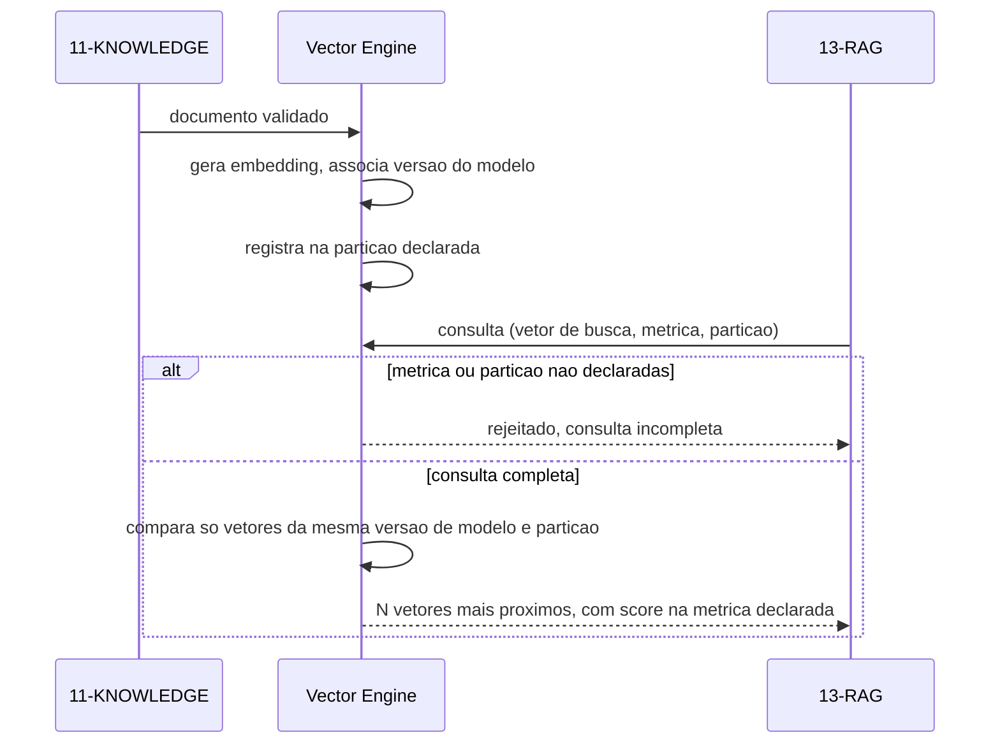
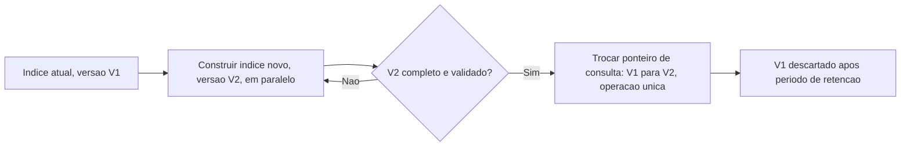

# Diagramas

A rejeição de consulta incompleta (ramo do meio) é o ponto mais importante do diagrama: um índice
que aceitasse consulta sem métrica ou partição declaradas teria que assumir um padrão implícito,
e esse padrão implícito é exatamente o tipo de decisão que deveria ser explícita — a métrica usada
na indexação, não uma suposição da camada de consulta.

## Reindexação atômica

A troca em `D` é uma operação única do ponto de vista de quem consulta — nunca existe um momento
em que parte da consulta vê V1 e parte vê V2 simultaneamente. Construir o índice novo em paralelo,
sem afetar o antigo até a troca completa, é o que garante essa atomicidade sem exigir período de
indisponibilidade — o custo é espaço de armazenamento duplicado durante a construção, não tempo
de espera para quem consulta.

## Por que a validação acontece antes da troca, não depois

Um índice que trocasse o ponteiro de consulta para a versão nova antes de validá-la completamente
exporia inconsistência ao primeiro consumidor que chegasse durante a janela de validação. A ordem
`B -> C -> D` no diagrama garante que a troca em si (`D`) só acontece depois que a versão nova já
provou estar completa — o custo de validar antes de trocar é tempo adicional de construção; o
custo de trocar antes de validar seria expor erro de reindexação diretamente a quem consulta.
