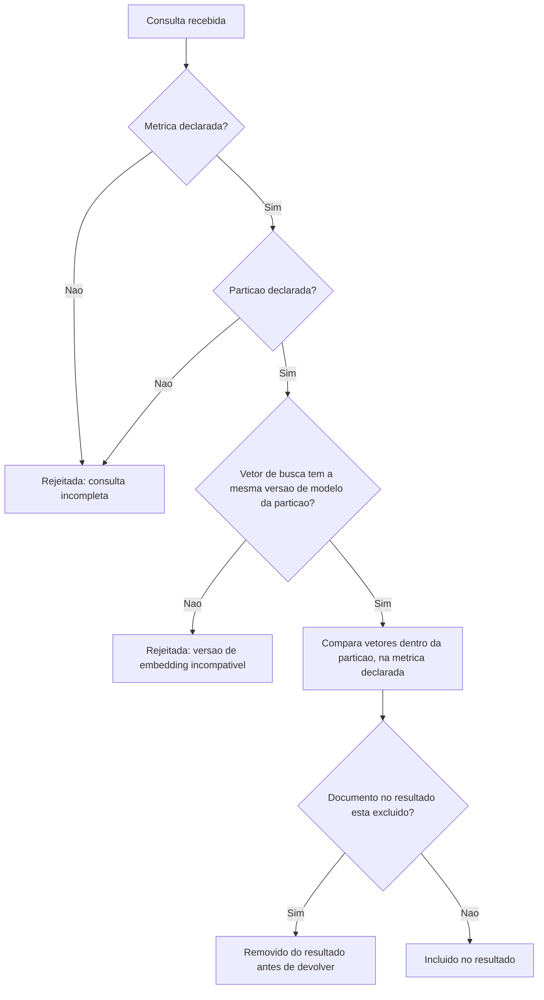
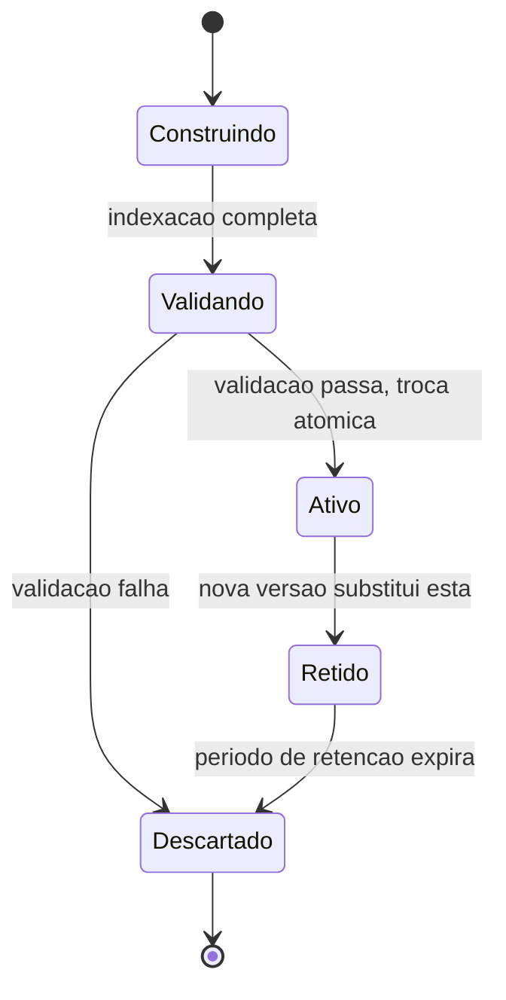

# Fluxogramas

Os três pontos de rejeição (`C` duas vezes, `F`) existem porque cada um previne uma classe
diferente de erro silencioso: consulta incompleta, cruzamento de partição, e comparação entre
espaços de embedding incompatíveis. Os três produzem sintoma parecido se não forem prevenidos —
resultado que "parece" razoável mas não é — e por isso os três são checados antes de qualquer
comparação de vetor acontecer, não depois.

## O caminho que garante exclusão real

O nó `H` roda depois da comparação de vetores, não antes — a exclusão é filtrada no resultado,
não removida preventivamente do espaço de busca a cada consulta, porque remoção física
imediata teria custo alto demais para operação frequente. A garantia que importa é que o
resultado devolvido nunca inclui documento excluído, independente de como a exclusão é
implementada fisicamente por baixo.

## Ciclo de vida de uma versão de índice

Uma versão de índice nunca pula de `Construindo` direto para `Ativo` — passa sempre por
`Validando`, o que impede uma reindexação incompleta ou corrompida de se tornar a versão
consultada. O estado `Retido` existe especificamente para permitir reversão: uma versão que
acabou de ser substituída continua disponível por um período antes de `Descartado`, caso a
versão nova revele um problema não capturado na validação inicial — a mesma disciplina de
retenção antes de descarte definitivo que `09-Boas-Praticas.md` recomenda para qualquer troca
atômica de estado em produção, não uma escolha específica deste volume.
