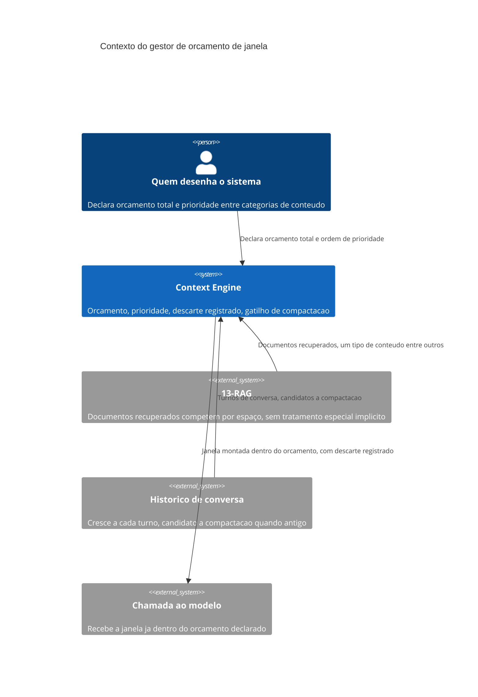

# Arquitetura

O gestor recebe candidatos de múltiplas fontes — histórico, documentos recuperados, resultado de
ferramenta — e nenhuma delas tem prioridade implícita sobre as outras só por ser a fonte mais
recente ou mais frequentemente usada. A prioridade é sempre uma decisão declarada por quem desenha
o sistema, não uma consequência acidental da ordem em que o conteúdo chegou ao gestor.

## Componentes

O **orçador** mantém o limite total de tokens e o consumo corrente, recusando adicionar conteúdo
que excederia o limite sem antes aplicar a política de descarte. O **priorizador** aplica a ordem
declarada entre categorias de conteúdo quando o orçamento não comporta tudo — instrução do
sistema tipicamente tem prioridade máxima (nunca descartada), seguida de ordem específica para
histórico, documentos recuperados e resultado de ferramenta. O **registrador de descarte** grava
o que foi removido e por qual categoria de prioridade, nunca descarta sem esse registro. O
**gatilho de compactação** decide, com margem antes do limite ser atingido, quando resumir
histórico antigo em vez de simplesmente descartá-lo.

## Por que categoria, não conteúdo, determina prioridade

A prioridade é atribuída à categoria do item (instrução, histórico, documento), nunca ao
conteúdo específico de um item individual dentro da categoria. Isso mantém a decisão de
prioridade simples e auditável — qualquer pessoa pode ler `ORDEM_DE_PRIORIDADE` inteira em
segundos, o que não seria possível se a prioridade dependesse de julgamento sobre o conteúdo de
cada item específico.
