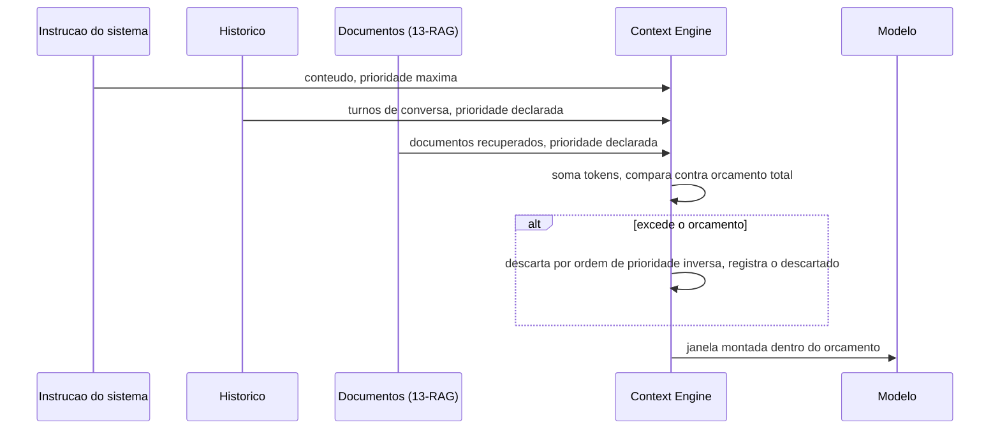
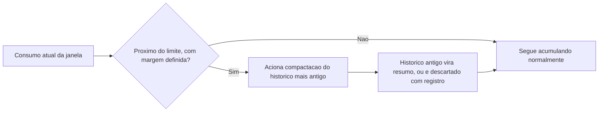

# Diagramas

A instrução do sistema entra com prioridade máxima declarada explicitamente, não por estar
tecnicamente "primeira" na montagem — um gestor que prioriza por ordem de chegada em vez de
prioridade declarada corre o risco de descartar instrução crítica só porque ela chegou depois de
um histórico longo, o que inverteria exatamente a intenção de quem desenhou o sistema.

## Gatilho de compactação

A margem em `B` existe para que a compactação em si tenha espaço para operar sem competir pelo
espaço que está tentando liberar — acionar compactação só quando o limite já foi atingido deixaria
o processo de compactação (que também consome tokens, se envolver geração de resumo) sem
orçamento disponível para funcionar.

## Por que a instrução de sistema nunca aparece no ramo de descarte

O diagrama de sequência não mostra nenhum caminho em que a instrução de sistema seja avaliada
para descarte — essa omissão é proposital, refletindo C6: a instrução só entra em consideração de
remoção no caso extremo (e tratado à parte) de exceder o orçamento total sozinha, nunca como
parte do ciclo normal de descarte por pressão de outras categorias. Um leitor que procurasse, no
diagrama, uma seta de "descarta instrução" não encontraria nenhuma — e essa ausência é a prova
visual de que a garantia não depende de disciplina externa, está embutida na própria forma do
fluxo descrito.
