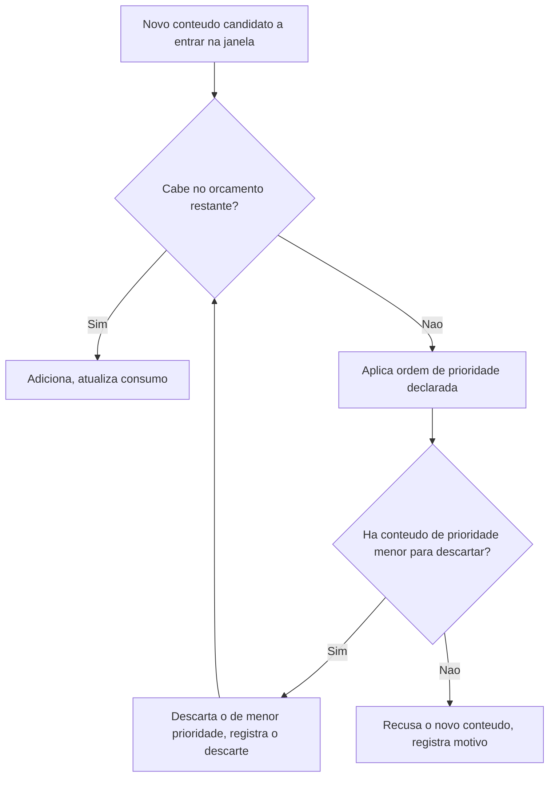
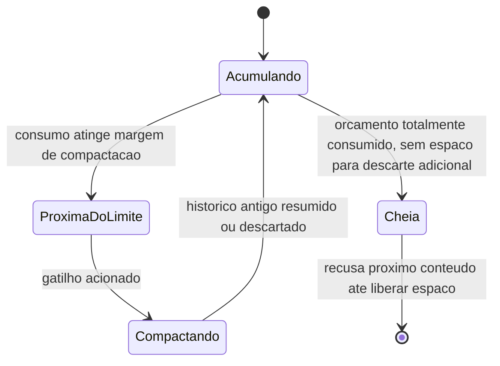

# Fluxogramas

O ciclo entre `E`, `F` e `B` continua até o novo conteúdo caber ou até não haver mais nada de
prioridade menor para descartar — nesse segundo caso, `G` recusa o próprio conteúdo novo, o que é
resultado legítimo quando até a instrução de prioridade máxima já consome o orçamento inteiro
sozinha, situação rara mas que o fluxo precisa tratar sem quebrar.

## Estados da janela de contexto

O estado `Cheia` é distinto de `ProximaDoLimite` — o primeiro significa que nem compactação
resolveria (tudo já é prioridade máxima), o segundo significa que ainda há histórico de menor
prioridade disponível para liberar espaço antes de qualquer recusa acontecer.

## Por que o caso de recusa em `G` é raro mas precisa existir

Um sistema bem configurado praticamente nunca alcança `G` — significa que a instrução de sistema,
que deveria ser um bloco de tamanho conhecido e estável, cresceu (ou o orçamento encolheu) até o
ponto de não caber sozinha. Tratar esse caso como erro de configuração a corrigir, não como
situação a acomodar silenciosamente, é o que `07-Regras.md` (C6) estabelece. Um sistema que
alcança `G` com frequência regular, em vez de raramente, está sinalizando um problema estrutural
de dimensionamento entre orçamento total e tamanho da própria instrução — não um evento isolado a
ser tolerado, e sim algo a ser corrigido na configuração antes que volte a acontecer.
