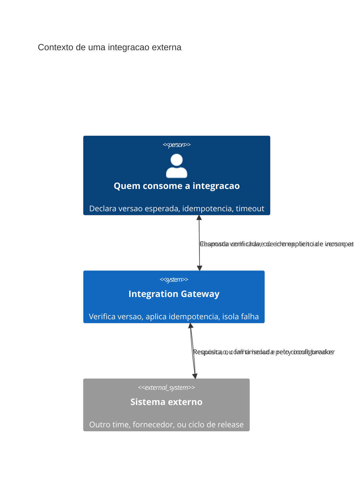

# Arquitetura

O gateway fica entre quem consome e o sistema externo — nenhuma chamada atravessa direto sem
passar pela verificação de versão, aplicação de idempotência e proteção de circuito. Essa camada
intermediária existe precisamente porque o sistema externo está fora do controle de quem
consome, e centralizar a proteção num único ponto evita que cada chamador reimplemente a mesma
lógica de forma inconsistente.

## Componentes

O **verificador de versão** confirma que a resposta do sistema externo está no formato esperado
antes de repassar ao consumidor — uma mudança de contrato não anunciada é detectada aqui, não
descoberta como erro de parsing mais adiante no sistema. O **aplicador de idempotência** garante
que uma chamada repetida (por retry de timeout, por exemplo) nunca duplica o efeito colateral do
lado externo, usando chave de idempotência quando o sistema externo suporta, ou deduplicação
local quando não suporta. O **isolador de falha** (circuit breaker) para de tentar chamar um
sistema externo que está falhando consistentemente, evitando que a lentidão ou indisponibilidade
dele se propague como lentidão do sistema inteiro.

## Por que centralizar num gateway, não distribuir a lógica

Se cada chamador implementasse sua própria verificação de versão, idempotência e circuit
breaker, pequenas divergências de implementação entre chamadores produziriam comportamento
inconsistente para a mesma integração externa — um chamador poderia reconhecer uma versão como
compatível enquanto outro a rejeitaria, por bugs sutis de implementação duplicada. Centralizar
no gateway garante que a política é uma só, aplicada de forma idêntica a todo chamador.
