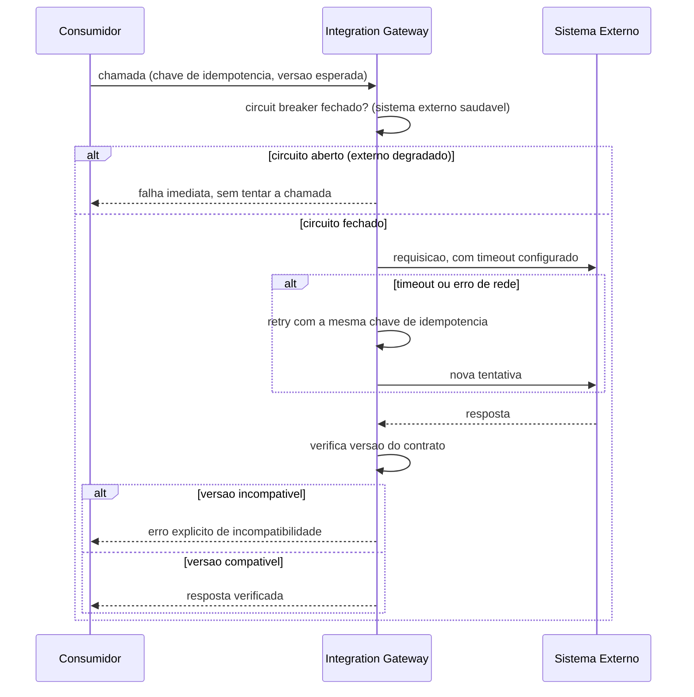
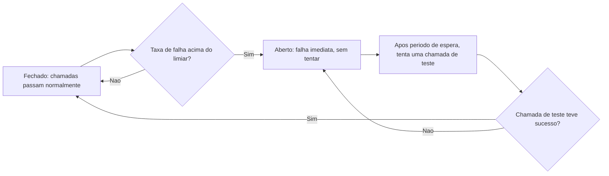

# Diagramas

O circuito aberto (ramo superior) é a defesa que impede uma chamada nova de sequer tentar contra
um sistema já conhecido como degradado — sem essa proteção, cada chamada nova esperaria pelo
timeout completo antes de falhar, multiplicando a lentidão externa pela quantidade de chamadas
simultâneas que o sistema interno está tentando fazer.

## Ciclo do circuit breaker

O estado `Aberto` nunca é permanente — o ciclo sempre volta a testar o sistema externo depois de
um período, porque a alternativa (permanecer aberto para sempre até intervenção manual) impediria
recuperação automática quando o sistema externo volta a funcionar normalmente.

## Por que o retry preserva a chave de idempotência

O `alt` de timeout no diagrama mostra a nova tentativa usando a mesma chave da tentativa
original, nunca uma chave gerada de novo — essa é a conexão direta entre o mecanismo de retry
(I3) e a garantia de idempotência (I2): sem preservar a chave entre tentativas, cada retry seria
uma operação logicamente nova aos olhos do sistema externo, e a proteção contra duplicação
deixaria de existir exatamente no cenário em que mais é necessária — falha de rede intermitente,
onde não se sabe se a operação original teve efeito ou não do outro lado. O diagrama de sequência
e o fluxograma de estados do circuit breaker se complementam: o primeiro mostra uma chamada
individual passando pelas verificações; o segundo mostra como o histórico de múltiplas chamadas
ao longo do tempo determina se a próxima sequer chega a ser tentada.
