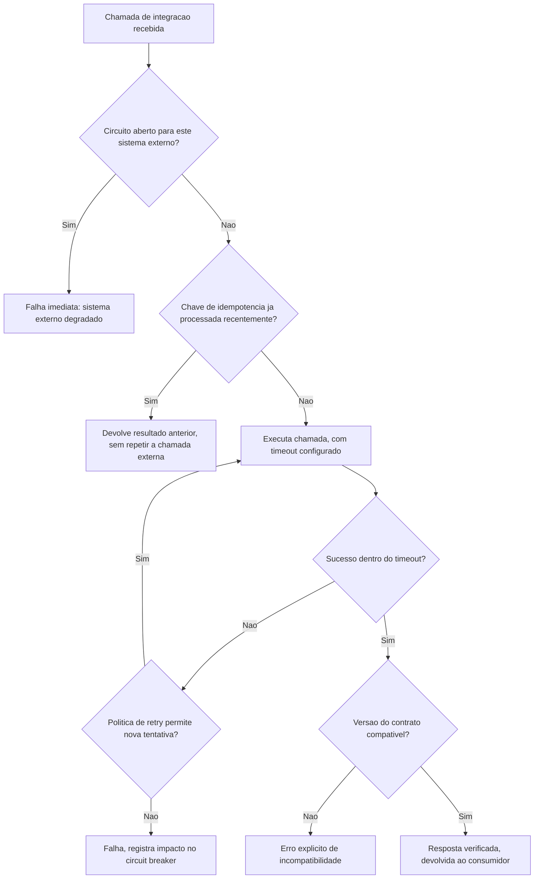

# Fluxogramas

O nó `D` (checagem de idempotência antes de executar) é o que garante que retry nunca duplica
efeito — se a mesma chave já foi processada, a resposta anterior é devolvida sem uma nova
chamada externa acontecer, independente de quantas vezes o consumidor repita a solicitação.

## O caminho que garante recuperação automática

O nó `I` (falha registrada no circuit breaker) alimenta o ciclo de abertura de circuito descrito
em `05-Diagramas.md` — falhas suficientes nesse caminho abrem o circuito, e a recuperação
automática, quando o sistema externo volta a funcionar, acontece sem intervenção manual, através
do mesmo mecanismo que detectou a degradação.

## Por que a checagem de idempotência vem antes da chamada externa

O nó `D` (checagem de cache de idempotência) acontece antes de `F` (execução da chamada), não
depois — isso significa que uma chamada repetida com a mesma chave nunca gera tráfego adicional
para o sistema externo, mesmo que o resultado já estivesse disponível. Colocar a checagem depois
da chamada externa ainda preveniria duplicação de efeito, mas desperdiçaria a chamada de rede
inteira antes de descobrir que era redundante — custo evitável simplesmente invertendo a ordem
das duas verificações no fluxo. Essa mesma lógica de "verificar antes de gastar recurso caro"
aparece em `B` também: checar o circuito antes de sequer montar a requisição evita gastar tempo
de preparação numa chamada que já se sabe, de antemão, que vai falhar.
