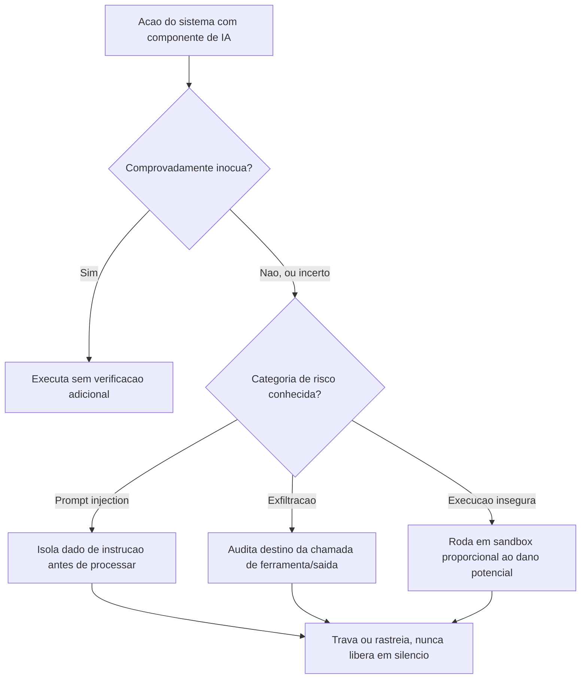

# Arquitetura

A arquitetura de segurança deste volume tem uma decisão central, generalizada do histórico real
do motor `ENGINE`: **classificar por comprovação de inocuidade, não por enumeração de perigo.**
Uma lista de ações proibidas (blocklist) tenta enumerar todo comportamento perigoso; um
classificador por comprovação de inocuidade assume que toda ação é potencialmente perigosa até
prova em contrário, e só libera sem verificação o que se prova estruturalmente seguro. A
diferença importa porque a primeira abordagem perde contra um espaço de ataque não enumerável —
sete rodadas de revisão adversarial encontraram doze contornos diferentes para uma lista de
proibições antes de o default ser invertido.

O fluxograma mostra a regra central: qualquer ação que não seja comprovadamente inócua entra
numa das três categorias de risco (ou combinação delas) e nunca é liberada sem passar por
travamento ou rastreamento — nunca em silêncio. Essa é a mesma lógica que motivou a família de
controles R9 a R12 do motor `ENGINE` (documentada em `README.md`): cada nova classe de risco
descoberta por auditoria adversarial vira uma família de controle nova, não uma correção pontual
do sintoma específico encontrado.

## Isolamento estrutural de dado e instrução

A defesa contra prompt injection mais robusta não é filtrar padrões de texto suspeitos dentro do
dado — é isolar estruturalmente a origem: dado processado (documento, resultado de busca,
conteúdo de e-mail) nunca é concatenado à instrução do operador de forma que o modelo não possa
distinguir as duas, e qualquer ação de alto risco decidida a partir de conteúdo derivado de dado
processado exige confirmação explícita antes de executar.
