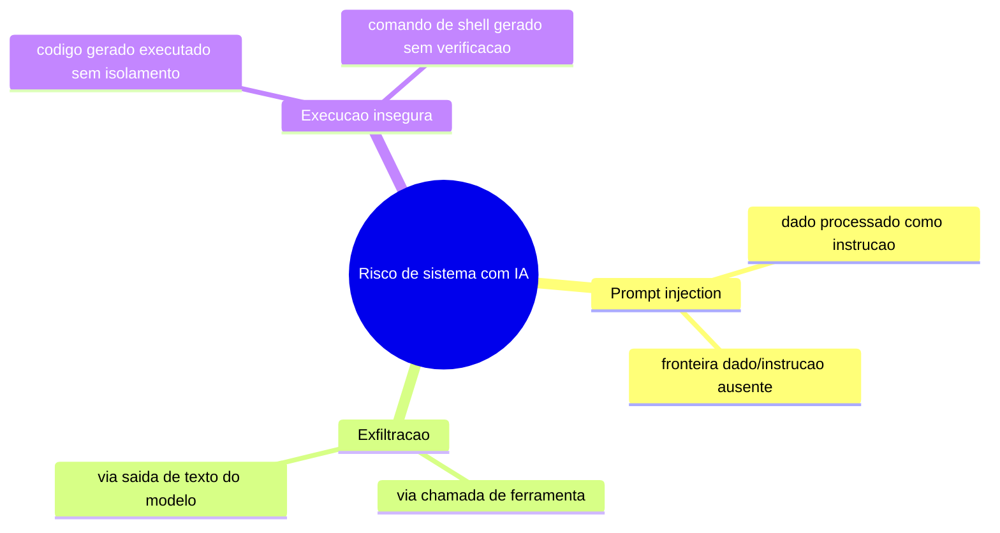
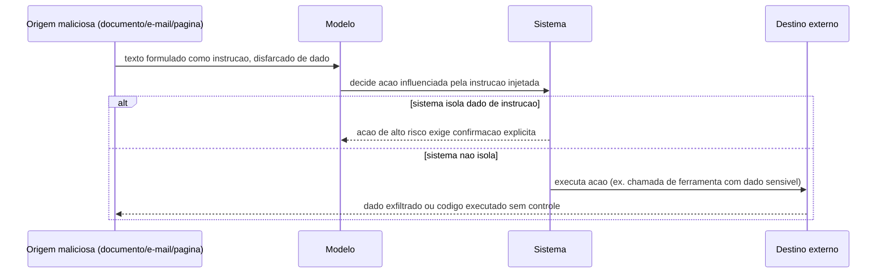

# Diagramas

As três categorias não são mutuamente exclusivas num incidente real: um prompt injection bem
sucedido tipicamente busca desencadear exfiltração ou execução insegura como objetivo final — a
injeção é o vetor de entrada, as outras duas são os efeitos que o atacante busca alcançar. Tratar
as três como camadas independentes de defesa (isolar dado de instrução, auditar destino de
chamada de ferramenta, isolar execução) significa que um vetor de injeção que passe pela primeira
camada ainda encontra a segunda e a terceira antes de causar dano real — defesa em profundidade,
não um único ponto de verificação.

## Cadeia de um ataque típico

A diferença entre os dois ramos do diagrama é inteiramente a decisão arquitetural descrita em
`04-Arquitetura.md`: um sistema que isola dado de instrução nunca chega ao ramo de exfiltração
sem uma confirmação explícita interposta — o ataque é contido antes do destino externo receber
qualquer coisa, mesmo que a instrução injetada tenha influenciado a decisão do modelo. O ponto
crítico do diagrama é o `alt`: a mesma instrução injetada chega ao sistema nos dois ramos, e a
diferença de resultado não vem de detectar a injeção em si, vem inteiramente de o sistema exigir
ou não confirmação antes de agir sobre algo influenciado por conteúdo de origem não confiável.
