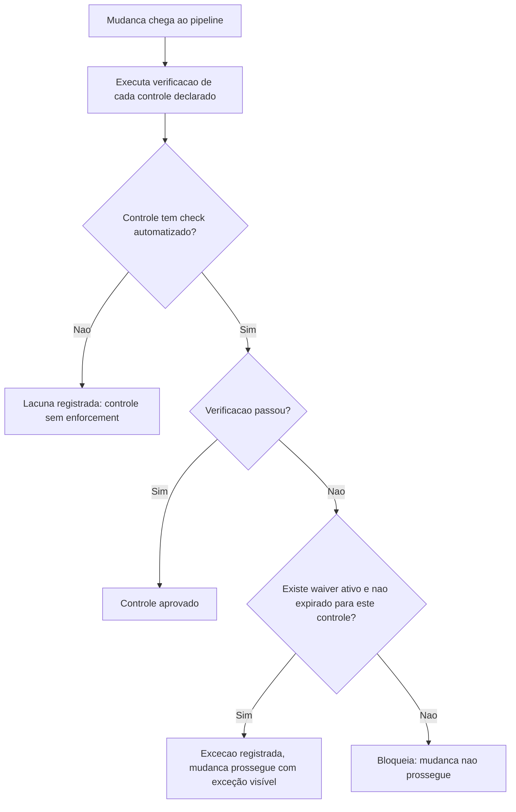

# Diagramas

O nó `C` (controle sem check automatizado) é o que distingue este processo de uma checklist
manual — em vez de assumir que um controle declarado está sendo verificado, o gate torna
explícita a diferença entre "declarado" e "enforçado", porque essas duas coisas divergem na
prática assim que o 17 ganha um controle novo e o pipeline ainda não foi atualizado para
verificá-lo.

O nó `G` (waiver ativo e não expirado) é a única saída que evita o bloqueio quando uma verificação
falha — não existe caminho de "ignorar e seguir" fora dessa checagem explícita, e é exatamente
essa ausência de atalho que torna toda exceção rastreável: se a mudança passou apesar de uma
falha, existe um waiver nomeado que explica por quê, com uma data em que essa permissão deixa de
valer.

A ausência de um caminho "verificação passou, mas sem check automatizado" no diagrama é
proposital — um controle sem automação nunca é avaliado como aprovado, porque não há nada
verificando; ele só pode terminar em `D` (lacuna registrada), nunca em `F` (controle aprovado).
Essa é a distinção central entre este processo e uma checklist manual assinada por alguém: aqui,
"aprovado" só existe quando uma verificação de fato rodou e passou, nunca por presunção de que o
controle provavelmente está sendo respeitado.