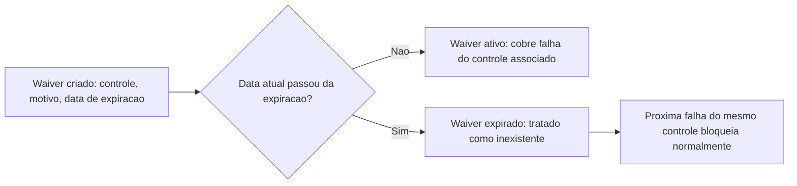

# Fluxogramas

Este fluxo é o que impede uma exceção temporária de virar permanente por esquecimento. O waiver
não precisa ser revogado ativamente para deixar de valer — a mera passagem da data de expiração
já o torna equivalente a não existir, do ponto de vista do gate. A alternativa (waiver que só
para de valer se alguém lembrar de removê-lo) inverte o ônus: coloca a responsabilidade de
manter o bloqueio ativo em uma ação humana que compete com todas as outras prioridades do time,
em vez de fazer o bloqueio ser o padrão que só é suspenso enquanto a exceção documentada
explicitamente permanece dentro do prazo que ela mesma declarou.

## Por que a falha vem antes da checagem de waiver, não depois

O fluxograma principal (`05-Diagramas.md`) checa se a verificação passou antes de checar se existe
waiver — nunca o contrário. Checar o waiver primeiro significaria consultar exceções para
controles que nem chegaram a falhar, um trabalho desperdiçado toda vez que a verificação já
passaria sozinha. A ordem atual só paga o custo de consultar waivers no caminho que de fato
precisa deles.

## Por que a lacuna do controle sem automação não bloqueia sozinha

Um controle sem `verificacao_automatizada` (D1) não bloqueia a mudança por si só — ele é
registrado como lacuna, e a mudança prossegue nos outros controles. Isso pode parecer
contraditório com "bloquear por padrão" (D2), mas a distinção é intencional: D2 bloqueia diante de
uma verificação que **rodou e falhou**; a ausência de verificação não é uma falha, é uma lacuna de
cobertura do próprio processo, e tratar as duas da mesma forma faria todo controle novo, ainda sem
automação, travar toda mudança até a automação existir — um incentivo perverso para nunca declarar
um controle novo antes de já ter o check pronto.