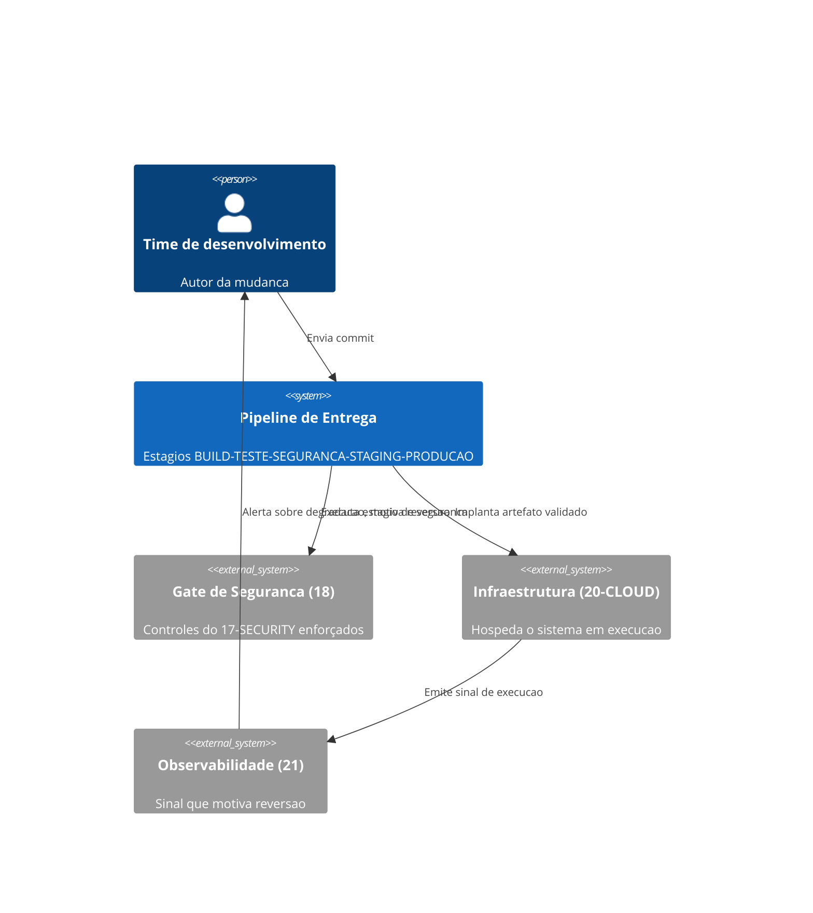
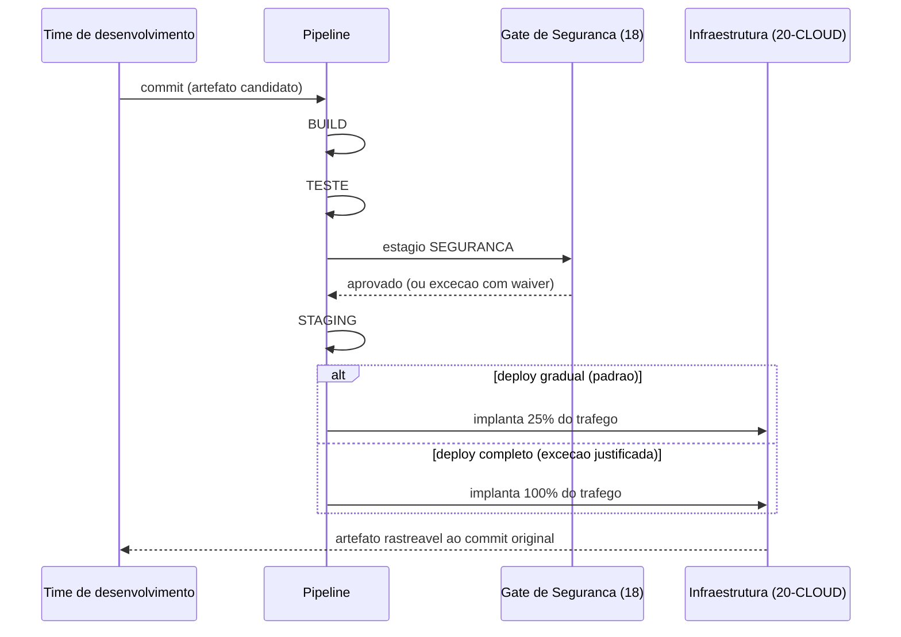
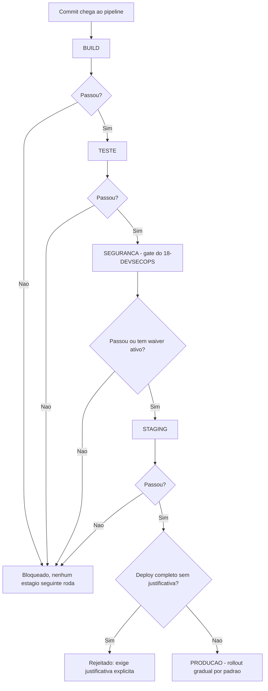

# Diagramas

O time de desenvolvimento nunca fala diretamente com a infraestrutura — toda mudança passa pelo
pipeline, que por sua vez consulta o gate de segurança do 18 como uma de suas etapas antes de
alcançar a infraestrutura do 20. O sinal de observabilidade do 21 fecha o ciclo, informando a
decisão de reverter sem fazer parte do caminho de implantação em si.

A troca de mensagens entre `Pipe` e `Sec` no diagrama de sequência é a mesma etapa que o
diagrama de estados do `06-Fluxogramas.md` detalha por dentro — aqui aparece como uma única
interação porque, do ponto de vista do pipeline, o resultado do gate é tudo o que importa para
decidir se avança; a lógica interna de waiver e expiração já foi resolvida pelo 18 antes de
responder.

O nó `X` (bloqueio) tem várias entradas mas nenhuma saída que contorne o pipeline — cada estágio
que falha leva ao mesmo destino, e não existe um caminho alternativo que permita a uma mudança
chegar a `L` sem ter passado por todos os nós anteriores em ordem. O nó `J` é a materialização de
P3: o padrão do fluxo é a resposta "não" (rollout gradual), e a resposta "sim" (deploy completo)
é o caminho que exige uma decisão explícita para ser tomado, nunca o caminho de menor resistência.
