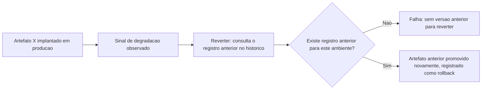

# Fluxogramas

A reversão nunca reconstrói nada — ela promove de volta um artefato que já existe no histórico,
com o mesmo hash que já passou por todos os estágios do pipeline da primeira vez. Isso é
deliberado: uma reversão que reconstrói a partir do código-fonte reintroduz exatamente o risco de
divergência entre o que foi validado e o que está rodando (P6) que este processo existe para
evitar — o artefato revertido já é conhecido, já foi testado, e sua reimplantação não passa de
novo pelos estágios anteriores porque ele já os atravessou.

## Por que o estágio de produção não pode rodar sem os anteriores completos

`Pipeline.pronto_para_producao` verifica a lista completa de estágios concluídos, não apenas o
último — um pipeline que checasse só "o estágio anterior passou?" seria vulnerável a um cenário em
que um estágio intermediário nunca rodou (por exemplo, uma falha de infraestrutura que pulou
silenciosamente o estágio de segurança). Checar a sequência inteira, não apenas o último passo,
é o que torna P1 uma garantia e não uma suposição.

## Por que reverter não passa pelos estágios de novo

O fluxo de reversão nunca reexecuta BUILD, TESTE ou SEGURANCA — o artefato promovido de volta já
carrega a prova de ter passado por eles na primeira vez, registrada implicitamente pelo fato de
ter chegado a produção antes. Reexecutar os estágios numa reversão não aumentaria a confiança no
artefato, porque nada sobre ele mudou desde a primeira validação; apenas atrasaria uma operação
que precisa ser rápida justamente quando a velocidade importa mais.