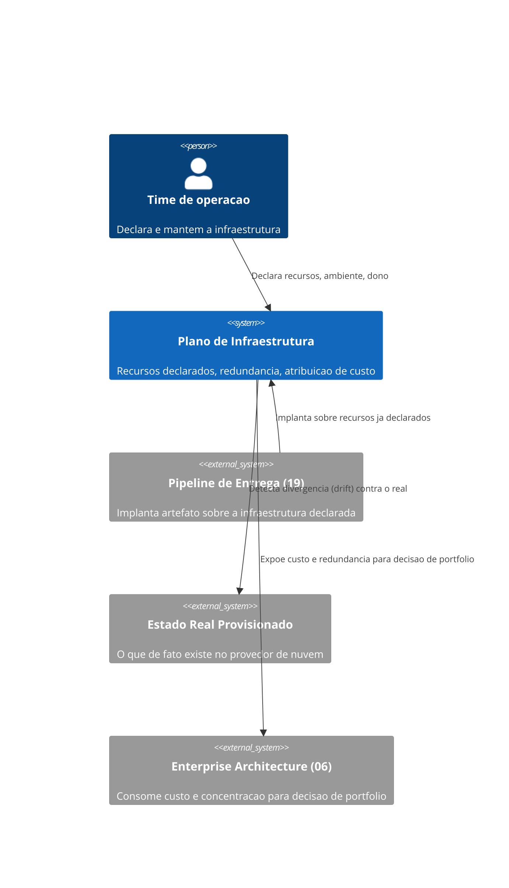
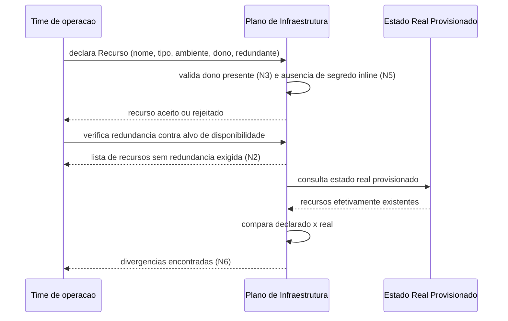

# Diagramas

O time de operação nunca interage diretamente com o estado real provisionado — toda declaração
passa pelo `Plano de Infraestrutura`, que é o único componente que compara o declarado contra o
real. Essa centralização é o que torna a detecção de divergência (N6) possível: sem um ponto único
de comparação, cada parte do sistema poderia ter uma visão diferente e desatualizada do que
realmente existe.

A validação de N3 e N5 acontece antes de qualquer verificação de redundância ou drift — um
recurso mal declarado (sem dono, ou com segredo inline) nunca chega a ser avaliado quanto a
disponibilidade ou comparado contra o estado real, porque ele nem deveria existir como declaração
válida em primeiro lugar.

O `Estado Real Provisionado`, no C4Context, é deliberadamente um sistema externo, não parte do
`Plano de Infraestrutura` — essa separação reflete que o real é observado, nunca controlado
diretamente pelo plano; o plano só consegue comparar, nunca impor, o que de fato existe do lado
do provedor.

O diagrama de sequência mostra a ordem de validação como uma cadeia estrita: N3 e N5 antes de
qualquer avaliação de N2, e N6 só depois que a declaração já é conhecida válida. Inverter essa
ordem — checar redundância antes de garantir que o recurso tem dono, por exemplo — produziria
verificações sobre um recurso que talvez nem devesse ter sido aceito como declaração em primeiro
lugar.