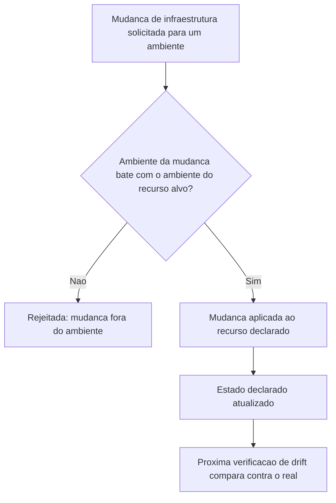

# Fluxogramas

O nó `B` é a materialização de N4 — não existe caminho no fluxo que permita uma mudança
declarada para staging alcançar um recurso de produção, porque a verificação de ambiente acontece
antes de qualquer aplicação, não depois. Isso elimina uma classe inteira de incidente onde uma
alteração destinada a um ambiente de teste vaza para produção por engano de configuração ou
contexto errado no momento da aplicação.

## Por que a detecção de drift não corrige automaticamente

`detectar_drift` (N6) reporta divergências, mas não as corrige sozinho — corrigir
automaticamente assumiria que o estado declarado está sempre certo e o real sempre errado, o que
nem sempre é verdade: às vezes a divergência revela que a declaração ficou desatualizada, não que
o real está errado. Separar detecção de correção mantém a decisão de qual lado ajustar como uma
decisão humana informada pela divergência, não uma reação automática que pode apagar uma mudança
legítima feita fora do fluxo declarado por engano.

## Relação com o isolamento de ambiente do 19-DEVOPS

O isolamento por ambiente (N4) deste volume e o isolamento de estágio do `19-DEVOPS` (P5)
resolvem problemas parecidos em camadas diferentes: aquele garante que uma mudança de código não
pula etapa do pipeline; este garante que uma mudança de infraestrutura não vaza para um ambiente
que não era o alvo pretendido. As duas garantias juntas fecham o caminho completo entre um commit
e o ambiente de produção, sem depender de disciplina humana em nenhum dos dois pontos.