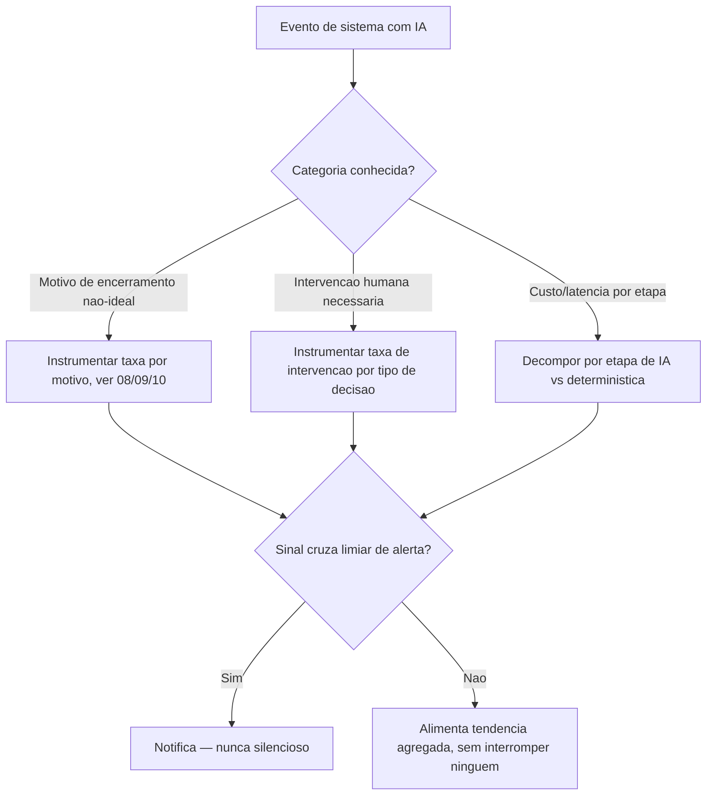

# Arquitetura

A arquitetura tem uma decisão central: nem todo sinal instrumentado gera alerta — a maioria
alimenta tendência agregada, e só sinais que cruzam um limiar explícito (definido por domínio,
não genérico) geram notificação. Essa separação evita dois extremos ruins: alertar demais (fadiga
de alerta, sinal real se perde no ruído) e não alertar o suficiente (anomalia real passa
despercebida até virar incidente maior). A regra que impede o extremo perigoso está em
`07-Regras.md`: todo sinal que cruza o limiar notifica, nunca fica só registrado silenciosamente
esperando alguém consultar por conta própria.

## Componentes

O **coletor de sinal** captura eventos das três categorias específicas de sistema com IA
(motivo de encerramento, intervenção humana, decomposição de custo) diretamente dos motores que
os produzem (`08`, `09`, `10` e outros) — não infere esses sinais indiretamente de log genérico.
O **avaliador de limiar** aplica o critério de "observar versus alertar" por domínio — o limiar
para taxa de encerramento por orçamento excedido em `08-AGENT-ENGINE` não é o mesmo limiar que
para taxa de saída de IA rejeitada em `10-WORKFLOW`, porque a criticidade e a variabilidade
esperada de cada sinal são diferentes. O **agregador de tendência** mantém a série histórica de
cada sinal, usada tanto para calibrar limiares (um limiar fixo desde o primeiro dia raramente é o
correto depois de meses de dado real) quanto para as métricas de cada volume individual.
