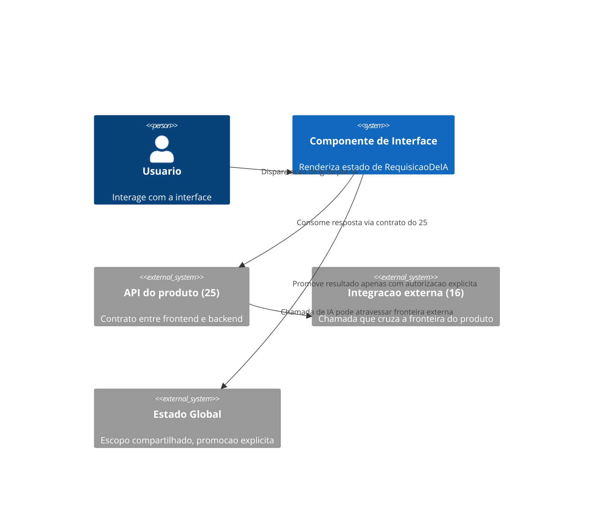
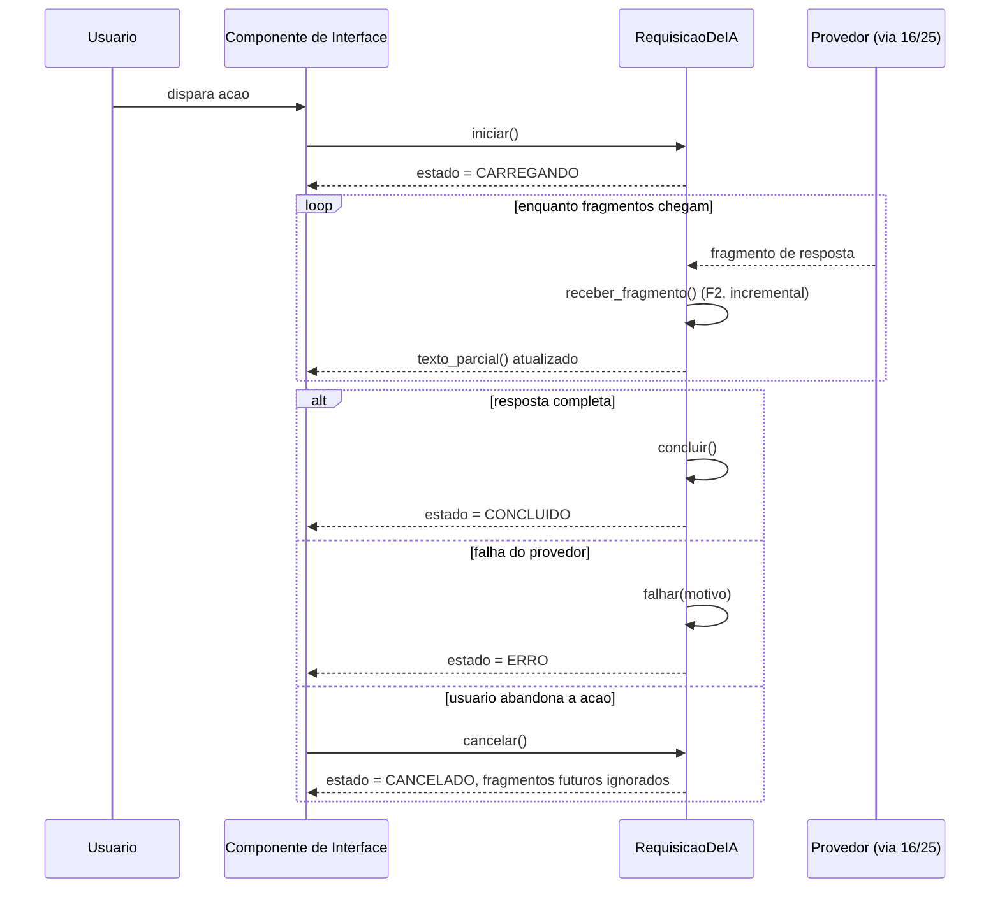

# Diagramas

O `Estado Global`, no diagrama, recebe uma seta rotulada explicitamente como condicional — a
promoção nunca é automática, e essa é a única relação do diagrama que carrega essa ressalva,
porque é a única onde um vazamento silencioso de escopo causaria dano real a partes não
relacionadas da interface.

O ramo de cancelamento não é um caso de erro — é um terceiro caminho legítimo e paralelo aos
outros dois, porque abandono de ação pelo usuário é comum o suficiente numa interface real para
merecer tratamento de primeira classe, não ser tratado como uma falha inesperada.

A separação entre `Provedor (via 16/25)` e `Componente de Interface`, no diagrama de sequência,
existe para deixar claro que a interface nunca fala diretamente com o provedor de IA — ela
sempre passa pelo contrato do 25 e, quando aplicável, pela robustez de chamada externa do 16. O
diagrama de sequência mostra a granularidade de fragmento a fragmento porque é exatamente aí que
F2 e F5 interagem: cada fragmento precisa checar se a requisição ainda está ativa antes de ser
aceito.

Nenhum dos dois diagramas modela um caso em que a interface espera pela resposta completa antes
de mostrar qualquer coisa — essa omissão é deliberada, porque esse caminho é exatamente o
anti-pattern que F2 existe para evitar, e um diagrama de arquitetura não deveria normalizar
visualmente um comportamento que o volume trata como erro.