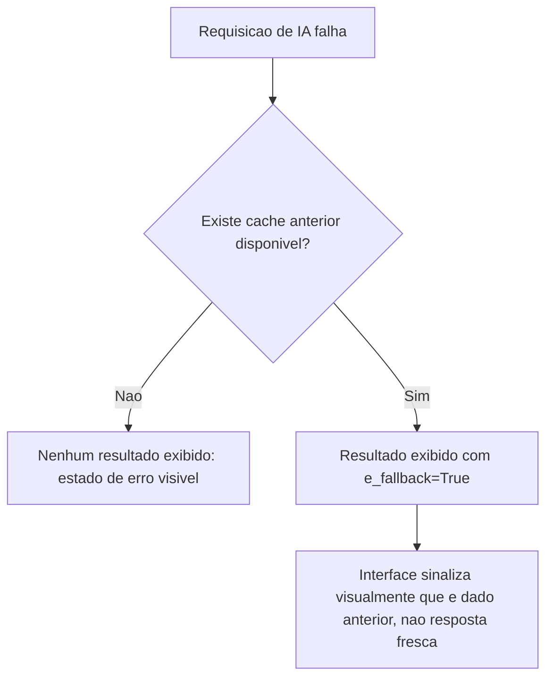

# Fluxogramas

O nó `E` é o que distingue este fluxo de um fallback silencioso — mostrar dado antigo sem
indicar que ele é antigo é pior, do ponto de vista do usuário, do que simplesmente mostrar que a
requisição falhou, porque um dado que parece fresco mas não é pode levar a uma decisão baseada em
informação desatualizada sem que o usuário saiba que deveria desconfiar dela.

## Por que fragmento recebido após cancelamento é descartado, não acumulado

Um fragmento que chega depois de `cancelar()` já não tem consumidor interessado — o componente
que originou a requisição pode ter sido desmontado, ou o usuário já navegou para outro contexto.
Acumular esse fragmento mesmo assim gastaria memória em um resultado que nunca será exibido, e
pior, criaria um risco de o fragmento tardio ser lido por engano se algum código verificar
`texto_parcial()` sem checar o estado primeiro. Descartar explicitamente, em vez de simplesmente
não usar, é o que torna esse comportamento uma garantia, não um acidente de implementação.

## Relação entre F3 e o cache mencionado em F5

O cache usado como fallback (F3) e o estado descartado após cancelamento (F5) não são a mesma
coisa, e a distinção importa: um cache de fallback representa uma resposta *completa e válida* de
uma chamada anterior bem-sucedida, guardada deliberadamente para o caso de uma chamada futura
falhar; um fragmento descartado por cancelamento é parte de uma resposta *incompleta*, de uma
chamada que o próprio usuário decidiu abandonar. Tratar os dois como intercambiáveis levaria a
exibir, como se fosse fallback confiável, um resultado que na verdade nunca chegou a se
completar.