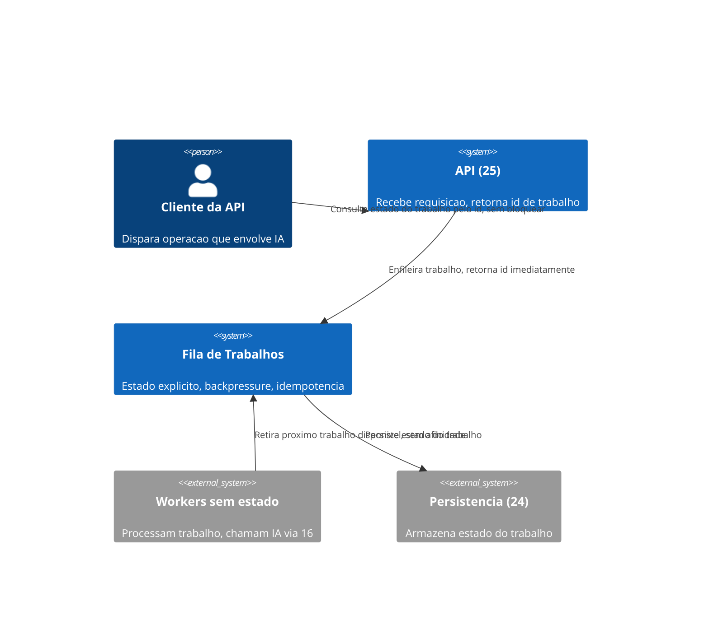
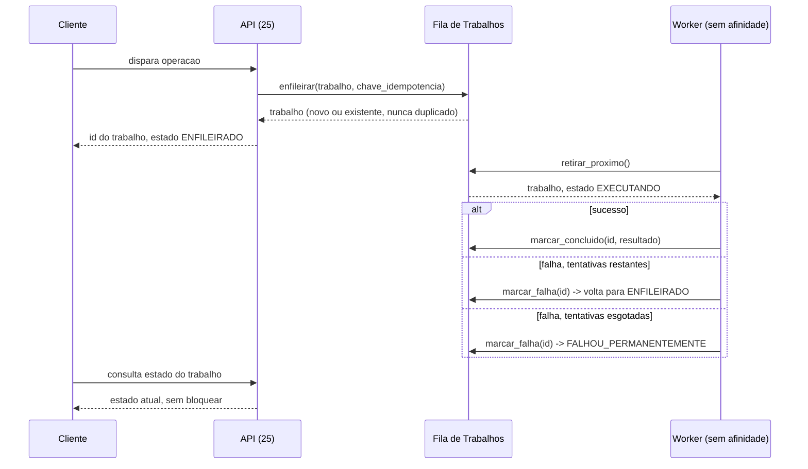

# Diagramas

A API nunca bloqueia esperando o trabalho terminar — ela enfileira e retorna um identificador
imediatamente, e uma segunda interação do cliente consulta o estado quando quiser. Essa separação
entre "disparar" e "consultar" é o que torna S1 possível: se a API bloqueasse até a conclusão, o
timeout da requisição HTTP voltaria a ser o limite real de quanto tempo um trabalho pode levar,
exatamente o problema que este volume existe para evitar.

Qualquer instância de `W` no diagrama poderia ser trocada por outra sem que o fluxo mude — nenhuma
mensagem depende de qual worker específico está processando, o que é a materialização visual de
S2.

Nenhuma mensagem no diagrama de sequência é dirigida a um worker nomeado especificamente — todas
usam o rótulo genérico `W (sem afinidade)`, e essa escolha de nomenclatura no próprio diagrama já
comunica visualmente a regra S2 antes mesmo de qualquer explicação textual.

O C4Context mostra a API retornando o id do trabalho imediatamente após enfileirar, antes de
qualquer processamento acontecer — essa é a representação visual direta de S1: a resposta da API
nunca espera o resultado da IA, apenas confirma que o trabalho foi aceito para processamento. A
consulta de estado, no final do diagrama de sequência, acontece numa troca de mensagens
completamente separada da que dispara o trabalho — reforçando que "disparar" e "verificar o
resultado" são duas interações distintas, nunca uma única chamada bloqueante.