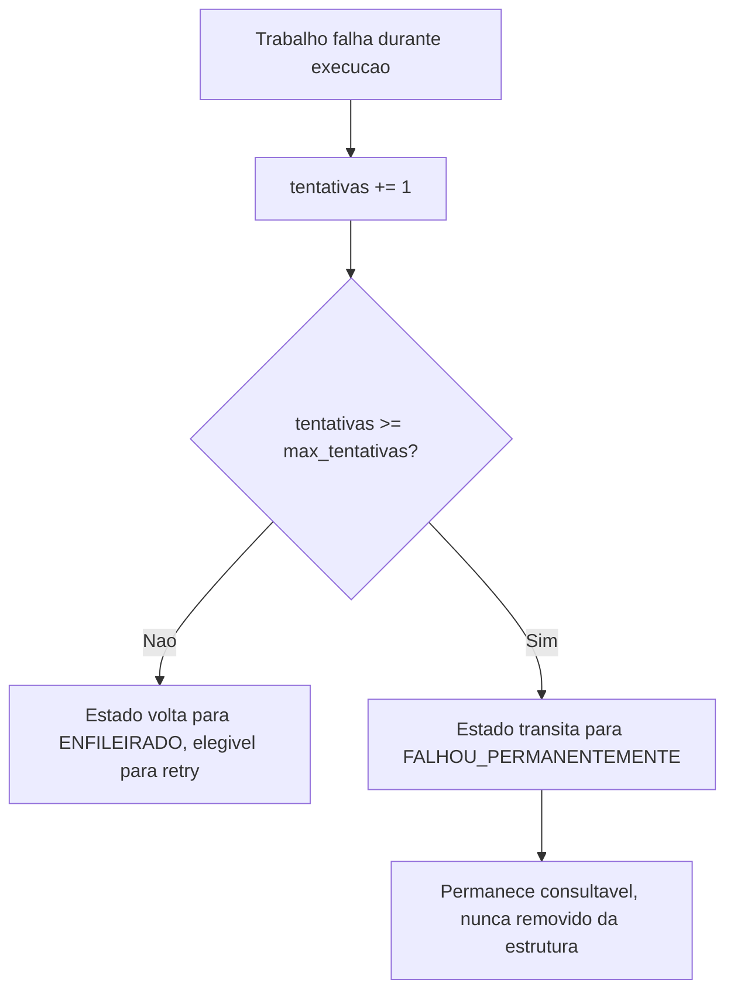

# Fluxogramas

O nó `F` é a materialização de S6 — um trabalho que esgotou as tentativas não desaparece da fila
nem fica em um estado ambíguo; ele existe permanentemente como um registro consultável de que
falhou, com o número de tentativas que consumiu. Isso é o que permite que alguém — humano ou
processo de monitoramento — encontre e trate esse trabalho depois, em vez de ele simplesmente
sumir sem deixar rastro.

## Por que retry reenfileira em vez de repetir imediatamente

O fluxo de retry (`D`) devolve o trabalho ao estado ENFILEIRADO, não repete a execução
imediatamente dentro do mesmo worker que acabou de falhar — isso é deliberado: se a falha foi
causada por um problema específico daquele worker (por exemplo, esgotamento momentâneo de
recurso local), repetir imediatamente no mesmo worker herdaria o mesmo problema; devolver à fila
permite que qualquer worker disponível, incluindo um diferente do que falhou, pegue a próxima
tentativa.

## Relação entre backpressure e política de retry

Backpressure (S3) rejeita a retirada de um trabalho *antes* de ele começar a processar, quando a
capacidade já está saturada; a política de retry (S5/S6) decide o que fazer *depois* que um
trabalho já começou e falhou. As duas operam em momentos diferentes do ciclo de vida e não devem
ser confundidas: um trabalho rejeitado por backpressure nunca chega a ser tentado, então nunca
consome uma tentativa da política de retry — ele simplesmente permanece ENFILEIRADO, esperando
capacidade ficar disponível.