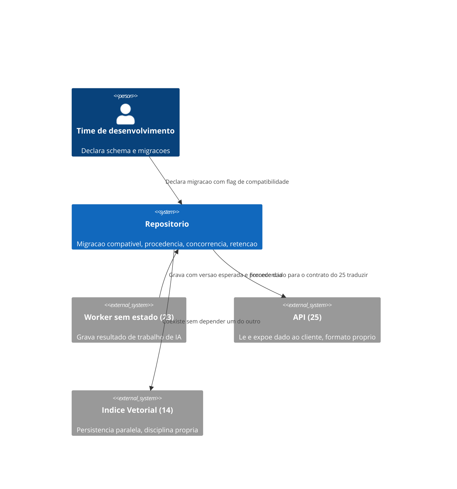
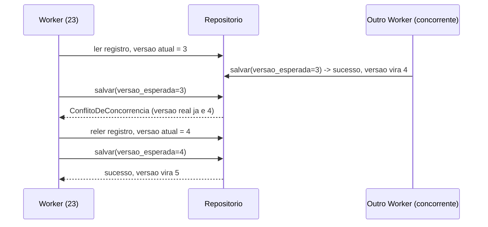

# Diagramas

O `Indice Vetorial (14)` aparece no diagrama como sistema paralelo, não como dependência — a
seta que os liga é rotulada "coexiste sem depender", porque nenhuma das garantias deste volume
(migração compatível, proveniência, concorrência, retenção) exige que um índice vetorial exista
ou funcione de determinada forma; os dois sistemas de persistência operam sob disciplinas
independentes, mesmo compondo o mesmo produto.

O worker que perde a corrida nunca sobrescreve silenciosamente o resultado do outro — ele recebe
o conflito, releva o estado atual, e decide (reaplicar sua mudança sobre o novo estado, ou
descartar) de forma explícita. Essa decisão nunca é tomada pelo repositório automaticamente,
porque só quem está gravando sabe se sua mudança ainda faz sentido sobre um estado que mudou.

O diagrama de sequência modela o cenário mais informativo — dois workers concorrentes — em vez do
caminho feliz de escrita única, porque é justamente sob concorrência que a diferença entre este
modelo e um repositório ingênuo de "última escrita vence" se torna visível.

Nenhum dos dois diagramas modela um cenário de escrita única sem concorrência — essa omissão é
deliberada, porque o caso trivial não distingue este modelo de um repositório ingênuo; a
concorrência é justamente onde a diferença de design se manifesta e vale a pena visualizar.