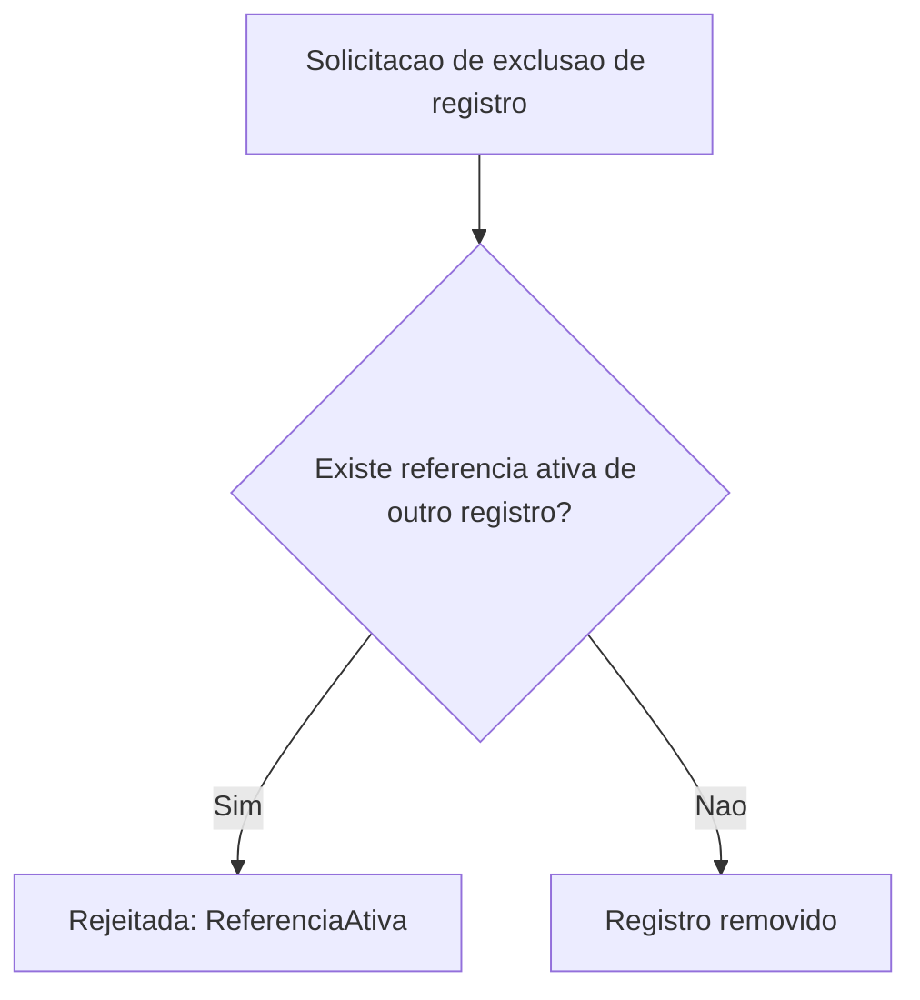

# Fluxogramas

O nó `B` é a materialização de A6 — uma exclusão nunca acontece sem antes verificar se outro
registro depende da existência daquele que está sendo removido. A alternativa (excluir e deixar a
referência quebrada) transfere o problema para o momento em que alguém tentar seguir aquela
referência, quando o contexto de por que ela existe já foi perdido, tornando o diagnóstico muito
mais difícil do que teria sido no momento da exclusão original.

## Por que migração incompatível é rejeitada antes de aplicada, não depois

`aplicar_migracao` verifica `compativel_com_versao_anterior` antes de registrar a migração no
histórico — nunca depois. Se a verificação acontecesse depois de aplicada, uma migração
incompatível já teria tido a chance de quebrar leitura de código ainda rodando a versão anterior
antes de ser revertida, e reverter uma migração de schema já aplicada é tipicamente muito mais
caro e arriscado do que simplesmente nunca tê-la aplicado.

## Relação entre A6 e A3

Referência ativa (A6) e conflito de concorrência (A3) protegem contra dois tipos diferentes de
inconsistência: A3 garante que duas escritas concorrentes ao mesmo registro nunca se perdem
silenciosamente; A6 garante que a relação entre registros diferentes nunca fica quebrada por uma
exclusão. Um sistema poderia ter A3 sem A6 (concorrência bem tratada, mas exclusão descuidada) ou
o contrário, então as duas regras precisam ser verificadas independentemente uma da outra.