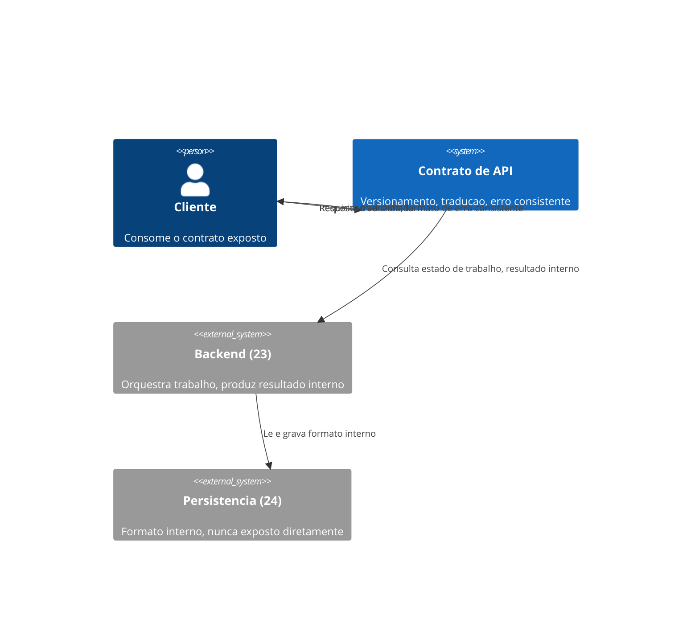
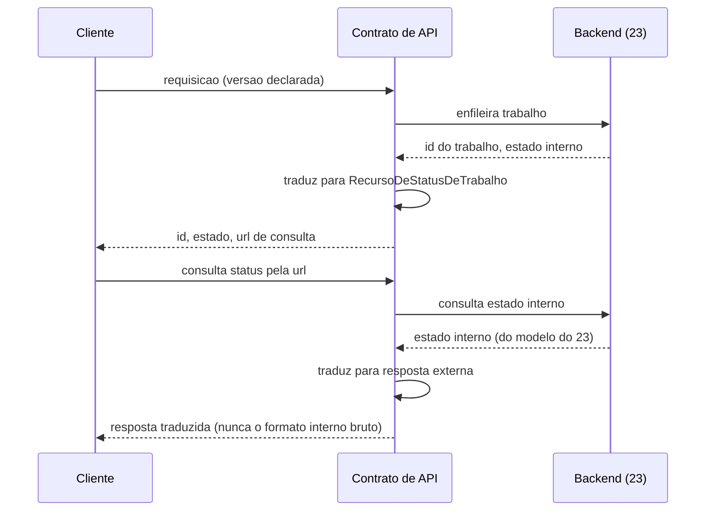

# Diagramas

A seta entre `Persistencia (24)` e `Cliente` não existe no diagrama — deliberadamente, porque não
há caminho direto entre os dois. Toda informação que chega ao cliente passa pelo `Contrato de
API`, que é o único ponto autorizado a decidir o que do formato interno atravessa e o que não.

A tradução acontece duas vezes no diagrama — na resposta inicial e na consulta de status — porque
nenhuma resposta ao cliente pula essa etapa, mesmo quando a informação de origem já está
disponível pronta internamente.

O `Backend (23)` aparece como sistema externo consultado pelo `Contrato de API`, nunca o
contrário — o backend não sabe nada sobre formato de resposta externa, apenas sobre estado
interno de trabalho; é o contrato que decide como traduzir esse estado para o que o cliente vê.

O diagrama de sequência mostra a tradução acontecendo tanto na resposta inicial quanto na
consulta de status subsequente, nunca apenas uma vez — isso comunica visualmente que a garantia
de T2 não é um evento único no momento de criar o trabalho, é uma disciplina aplicada a toda
resposta que sai do sistema, em qualquer ponto da interação com o cliente.

Isso vale mesmo quando a resposta parece trivial de montar — a disciplina de nunca pular a
tradução é o que a diferencia de um atalho que só existe até o dia em que o formato interno muda.