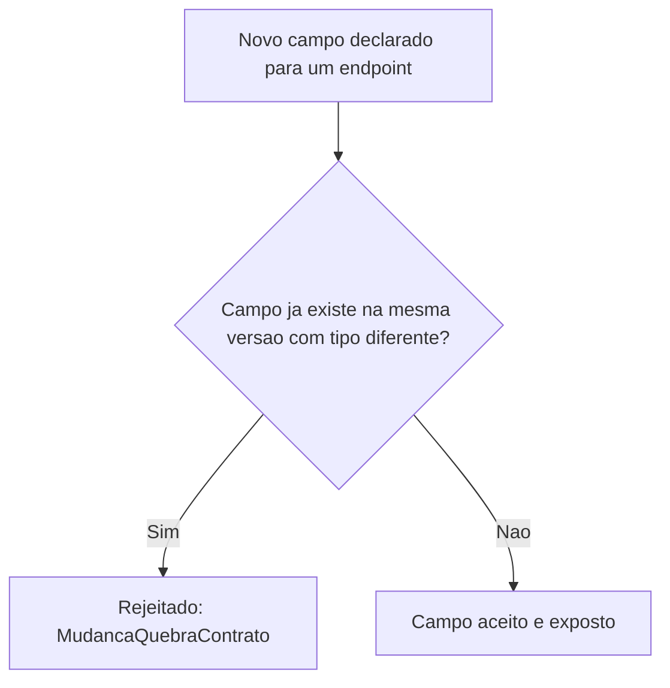

# Fluxogramas

O nó `B` é a materialização de T1/T5 — a mesma verificação cobre tanto uma mudança de tipo quanto
uma repropositação semântica de campo, porque as duas produzem o mesmo problema prático: um
cliente que já confia no significado atual de um campo recebe algo diferente sem que a versão do
contrato tenha mudado para sinalizar isso.

## Por que orçamento de latência é verificado na declaração do endpoint, não em tempo de execução

`declarar_endpoint_sincrono` recusa a ausência de orçamento no momento em que o endpoint é
declarado, não quando ele é chamado pela primeira vez em produção — encontrar essa lacuna cedo,
antes de qualquer cliente real depender do endpoint, é significativamente mais barato do que
descobrir através de uma reclamação de latência inesperada depois que o endpoint já está em uso
por múltiplos consumidores que assumiram um comportamento que nunca foi de fato declarado.

## Relação entre T1 e T6

Versionamento (T1) protege contra mudança estrutural sob a mesma versão; orçamento de latência
(T6) protege contra expectativa de tempo não declarada. As duas são independentes — um endpoint
pode ser perfeitamente versionado e ainda assim não declarar quanto tempo leva, e um endpoint com
orçamento declarado pode, separadamente, introduzir uma mudança de campo que quebra
compatibilidade. Nenhuma das duas verificações substitui a outra.

Nenhuma das duas verificações substitui a outra, e um sistema real precisa das duas
independentemente: um endpoint pode ter orçamento de latência bem declarado e mesmo assim
introduzir uma mudança de campo incompatível na mesma versão; o inverso também é verdadeiro.