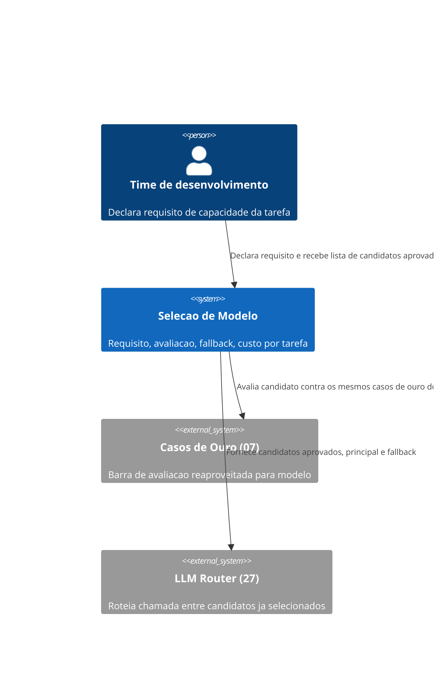
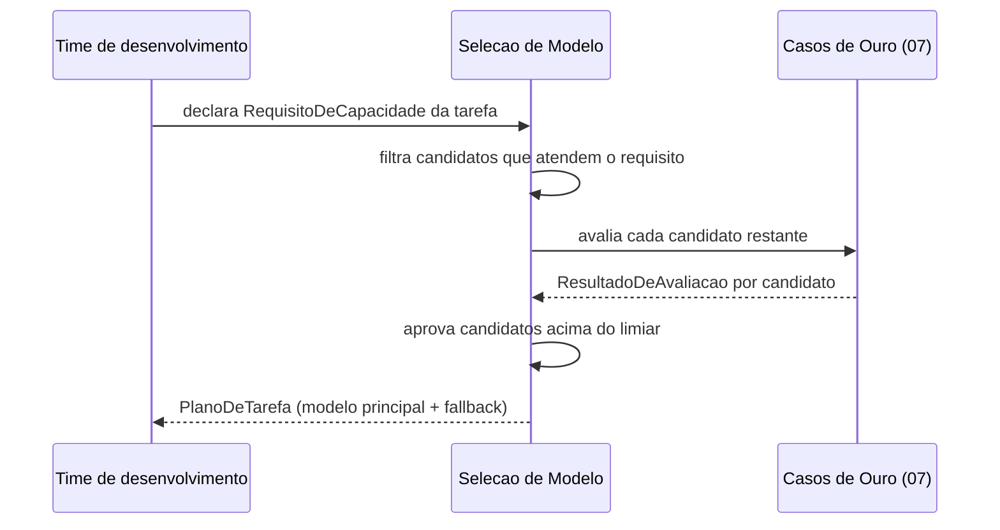

# Diagramas

O `LLM Router (27)` nunca decide sozinho quais modelos são elegíveis — ele recebe a lista já
filtrada por este volume, o que mantém a fronteira entre "quais modelos podem ser usados" (aqui)
e "qual candidato específico atende esta chamada agora" (naquele) sem sobreposição.

Nenhum candidato chega à etapa de aprovação sem antes passar pelo filtro de requisito — um modelo
poderoso mas que não atende a modalidade ou janela de contexto exigida nunca chega a ser avaliado
contra os casos de ouro, economizando o custo de uma avaliação que já seria descartada de
qualquer forma.

O C4Context deixa explícito que `Selecao de Modelo` nunca conversa diretamente com um provedor de
modelo específico — essa conversa, quando existe, acontece através do `LLM Router (27)`, mantendo
este volume livre de qualquer acoplamento a fornecedor específico, alinhado à regra de volume
perecível.

O `sequenceDiagram` termina na entrega de um `PlanoDeTarefa`, não numa chamada real ao modelo —
esse limite é intencional, porque o que acontece depois da seleção (a chamada em si, roteada pelo
27) já não é responsabilidade deste volume.

Isso mantém o diagrama estável mesmo quando o mecanismo de roteamento do 27 mudar por dentro,
sem exigir revisão deste volume só porque a implementação daquele mudou de tecnologia.