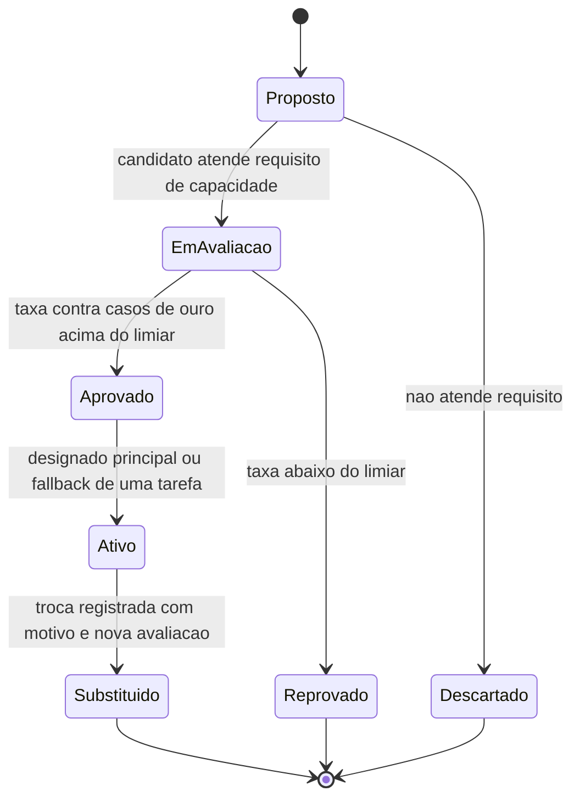

# Fluxogramas

O estado `Ativo` nunca transiciona diretamente para `Proposto` de outro candidato sem passar por
`Substituido` — toda troca de modelo em uso passa pelo registro explícito que M6 exige, nunca uma
transição implícita que pularia o rastro de por que a troca aconteceu.

## Por que requisito de capacidade filtra antes da avaliação

O fluxo de estado começa filtrando por requisito de capacidade antes de considerar avaliação —
um candidato que não atende modalidade ou janela de contexto exigida é descartado sem nunca
consumir o custo de rodar os casos de ouro contra ele, que só faz sentido gastar em candidatos
que já são elegíveis para a tarefa em primeiro lugar.

## Relação com M6

O estado `Substituido`, no diagrama de estado, é sempre alcançado através de uma transição
nomeada, nunca implícita — essa é a mesma disciplina que `registrar_troca` aplica em código: uma
troca de modelo sempre passa por uma operação explícita, com motivo e avaliação associados, nunca
uma reatribuição silenciosa de qual modelo atende uma tarefa.

Nenhuma seta do diagrama de estado sai de `Ativo` diretamente para `[*]` — um candidato ativo só
termina seu ciclo passando por `Substituido`, nunca desaparecendo sem deixar essa transição
registrada no histórico que M6 exige.

Essa disciplina de nomear a transição é o que torna o histórico auditável depois.