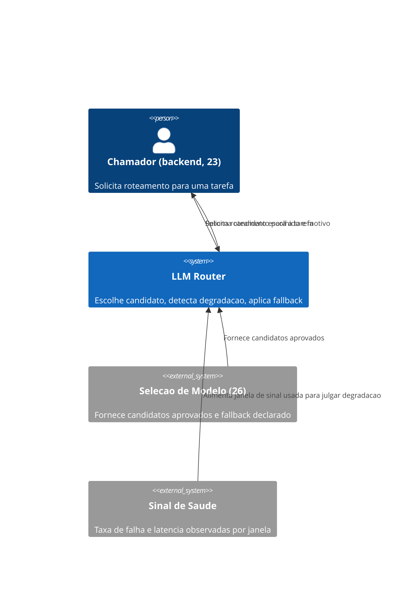
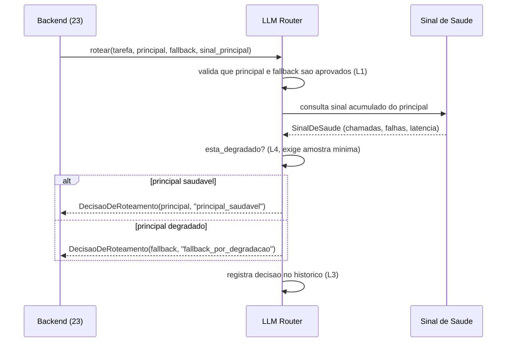

# Diagramas

O roteador nunca consulta `Selecao de Modelo (26)` durante o roteamento em si — a lista de
candidatos aprovados é fornecida a ele previamente, mantendo a decisão de roteamento rápida e
sem depender de uma chamada síncrona adicional a cada requisição.

A validação de candidatos aprovados (L1) acontece antes de qualquer consulta a sinal de saúde —
não há razão para avaliar degradação de um candidato que nem deveria estar sendo considerado.

Essa escolha de design — buscar a lista de candidatos previamente, não a cada chamada — é o que
torna o roteamento rápido o suficiente para ficar no caminho crítico de cada requisição, sem
adicionar uma consulta síncrona extra a outro sistema toda vez que uma decisão precisa ser
tomada.

O diagrama de sequência não modela retry da chamada de sinal de saúde em si — essa responsabilidade, se necessária, pertence à integração real com observabilidade, fora do escopo deste modelo mínimo.

Esse limite de escopo mantém o diagrama focado na decisão que este volume de fato governa, sem
tentar documentar comportamento que já é responsabilidade de outro volume vizinho, como o 16 ou
o 21. Manter os dois diagramas enxutos, cobrindo só a decisão de roteamento em si, é consistente
com a regra de volume perecível — menos superfície documentada significa menos texto que
envelhece mal quando a topologia real do sistema mudar.