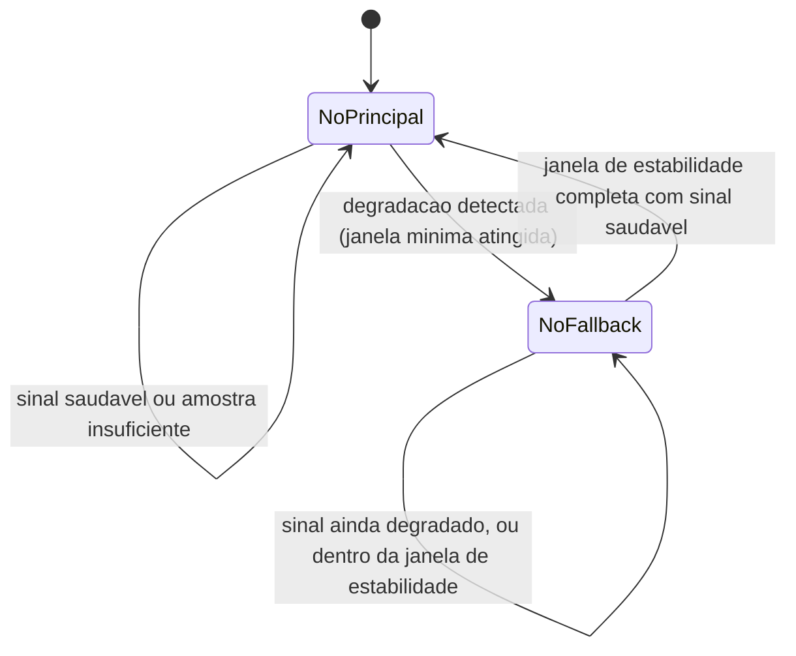

# Fluxogramas

O estado `NoFallback` só retorna a `NoPrincipal` depois de completar a janela de estabilidade —
nunca no primeiro sinal saudável isolado. Essa assimetria entre "cair rápido, subir devagar" é
proposital: o custo de ficar um pouco mais no fallback depois que o principal já melhorou é
pequeno; o custo de alternar de volta cedo demais e cair de novo é uma oscilação (`flapping`) que
degrada a experiência mais do que qualquer um dos dois estados isolados.

## Por que a amostra mínima existe antes de julgar degradação

Uma única chamada falha não distingue entre "o candidato está degradado" e "esta chamada
específica teve azar" — sem uma janela mínima de amostra, o roteador reagiria a ruído estatístico
tanto quanto a sinal real, trocando de candidato por motivos que desaparecem sozinhos na próxima
chamada.

## Relação com L1

A validação de candidato aprovado (L1) não aparece no diagrama de estado porque acontece antes de
qualquer transição de estado ser sequer considerada — um candidato rejeitado nunca chega a influir
no estado `NoPrincipal` ou `NoFallback`, a rejeição acontece num nível anterior à máquina de
estados em si.

Essa ordem — validar elegibilidade primeiro, decidir estado depois — evita gastar qualquer lógica de máquina de estado num candidato que nunca deveria estar em consideração.

A ordem inversa desperdiçaria trabalho de avaliação de estado sobre um candidato já descartado.