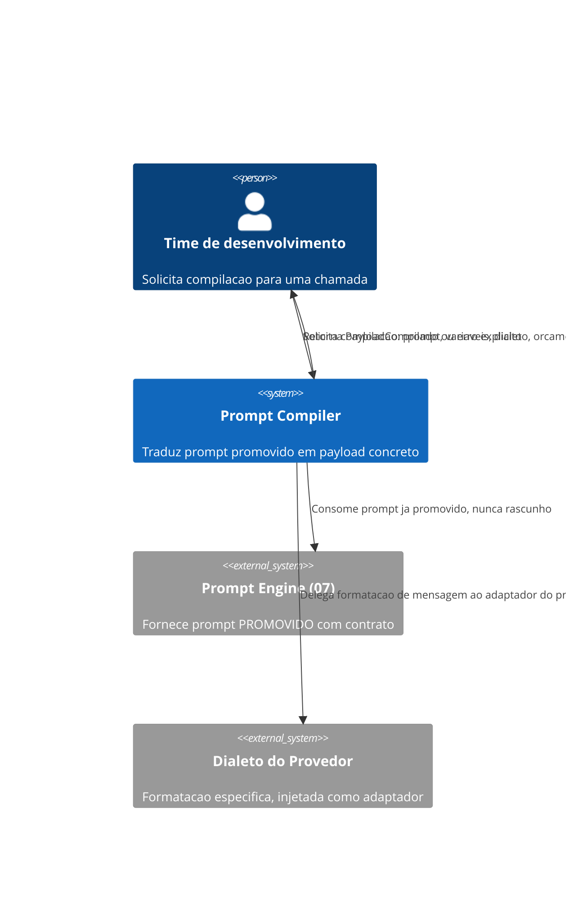
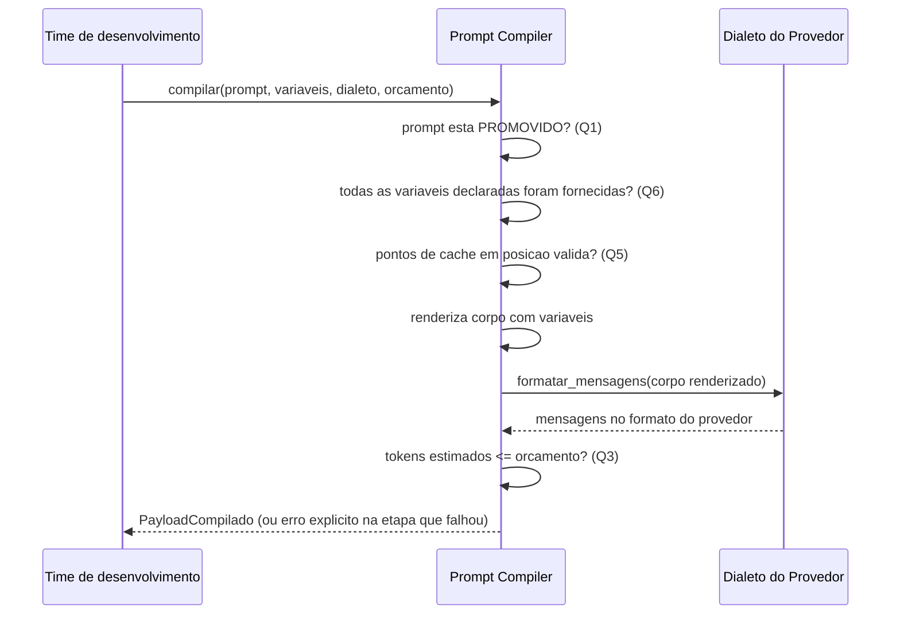

# Diagramas

O `Prompt Compiler` nunca decide, por conta própria, que um prompt está pronto para uso — essa
decisão já foi tomada pelo `Prompt Engine (07)` antes de o prompt sequer chegar aqui. A seta entre
os dois é unidirecional: o compilador consome o contrato promovido, nunca escreve de volta no
registro do 07.

Cada verificação do diagrama de sequência tem uma posição fixa — nenhuma delas é pulada nem
reordenada, porque cada uma pressupõe que a anterior já passou (não faz sentido checar orçamento
de um payload que nunca chegou a ser renderizado por variável ausente).

O adaptador `Dialeto do Provedor`, no C4Context, aparece como sistema externo injetado, nunca
como parte interna do `Prompt Compiler` — essa modelagem visual reforça Q4: o núcleo nunca
incorpora lógica de provedor específico, apenas consome o que o adaptador fornece.

Isso mantém o compilador substituível por qualquer implementação futura de tradução de provedor sem exigir mudança neste diagrama.

A troca de um dialeto por outro nunca exige tocar nenhum outro componente do sistema representado
nos dois diagramas, incluindo o próprio `Prompt Compiler`, cujo comportamento central permanece
idêntico independente de qual adaptador está conectado a ele no momento da compilação — essa
estabilidade é o que permite adicionar suporte a um provedor novo sem revisar código já testado.