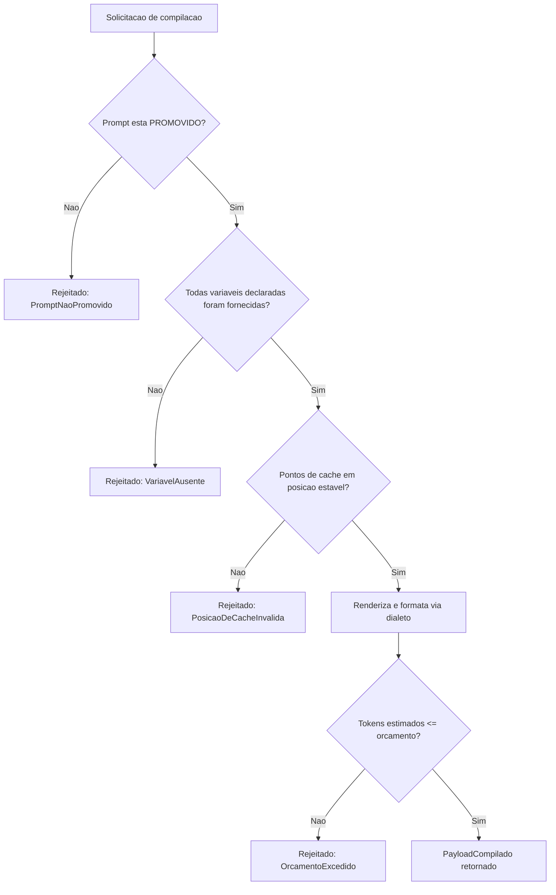
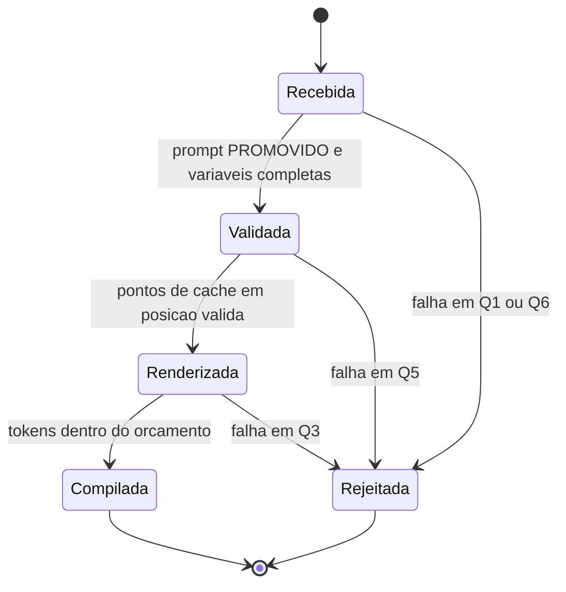

# Fluxogramas

Cada ramo de rejeição do fluxo corresponde a uma exceção nomeada e específica — nunca uma
mensagem de erro genérica que exigiria inspecionar o payload parcial para descobrir o que deu
errado. Quem recebe a rejeição sabe imediatamente qual das quatro verificações falhou.

## Por que posição de cache é verificada antes da renderização

O nó `F` verifica posição de cache antes de renderizar o corpo — mesmo que essa verificação não
dependa do conteúdo renderizado, ela é mais barata que a renderização em si, e não há razão para
pagar o custo de formatar mensagens que serão descartadas por uma posição de cache inválida
declarada desde o início da solicitação.

## Ciclo de vida de uma solicitação de compilação

Nenhuma solicitação alcança `Compilada` sem passar por `Validada` e `Renderizada` em sequência —
não existe atalho de `Recebida` direto a `Compilada`, porque cada estado intermediário representa
uma verificação que a anterior não cobre. Uma solicitação rejeitada em qualquer ponto termina o
ciclo imediatamente, sem tentar as verificações seguintes sobre um payload que já se sabe
inválido.

O `stateDiagram-v2` e o `flowchart` descrevem a mesma sequência de decisão em dois níveis: o
flowchart mostra a lógica condicional exata, incluindo as exceções específicas de cada rejeição;
o diagrama de estado mostra a jornada de mais alto nível que uma solicitação percorre,
independente de qual regra específica causou uma rejeição em determinado ramo.