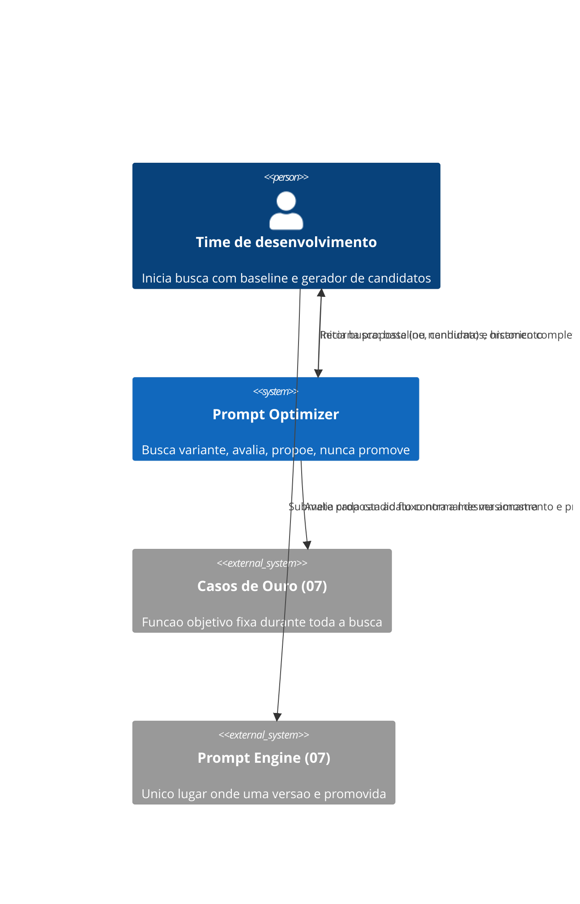
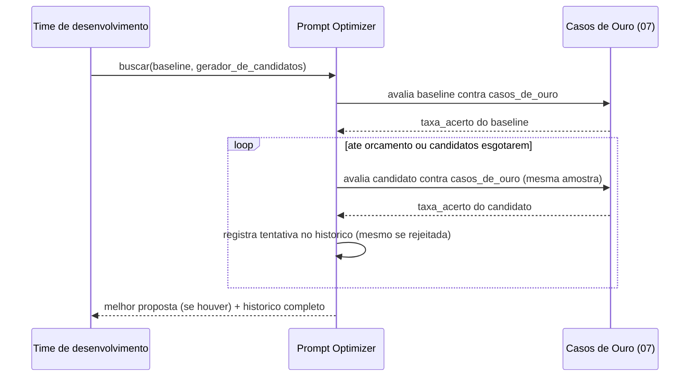

# Diagramas

Não existe seta direta entre `Prompt Optimizer` e `Prompt Engine (07)` decidindo promoção — a
proposta sempre volta para quem iniciou a busca, e é esse fluxo humano (ou automatizado, mas
externo a este volume) que submete a proposta ao 07 como qualquer outra versão candidata.

A amostra `casos_de_ouro` aparece em toda iteração do loop como o mesmo valor — nunca uma amostra
diferente por candidato, porque comparar candidatos avaliados sob condições diferentes invalidaria
qualquer conclusão sobre qual de fato é melhor.

O diagrama de sequência mostra a mesma amostra `casos_de_ouro` sendo passada em cada iteração do
laço — essa repetição visual é intencional, reforçando que não existe um caminho alternativo onde
um candidato específico recebe tratamento diferente dos demais.

Nenhum outro valor aparece nessa posição em nenhuma parte do fluxo representado, do início ao fim da busca completa.

Essa consistência visual é o próprio argumento de O1 expresso em forma de diagrama, sem precisar
de explicação textual adicional para ser percebida por quem lê o fluxo pela primeira vez, sem
contexto prévio sobre as regras específicas deste volume — o diagrama já comunica a garantia
antes mesmo de o leitor chegar à seção de regras formais mais adiante no mesmo documento.