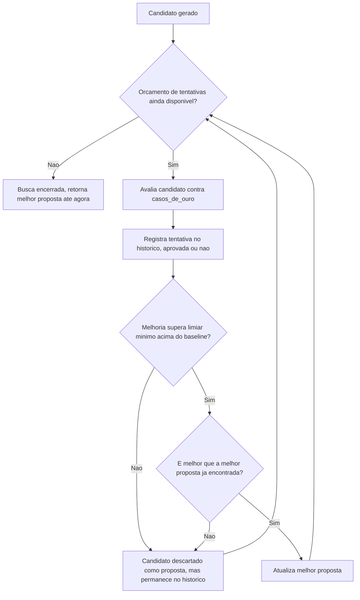
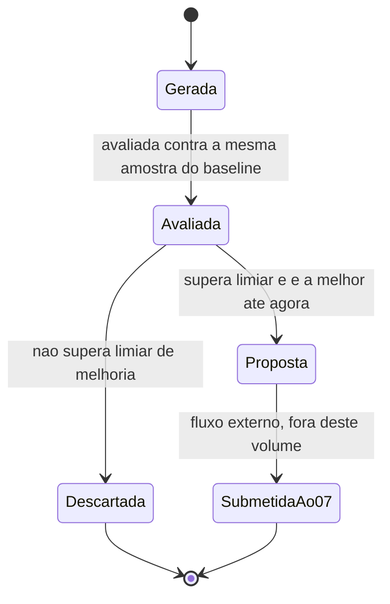

# Fluxogramas

O nó `E` (registro no histórico) acontece antes do nó `F` (critério de melhoria) — toda tentativa
é registrada independente de o resultado da avaliação de melhoria, porque o registro serve para
visibilidade do espaço já explorado, não apenas para as tentativas que "venceram".

## Ciclo de vida de uma proposta

O estado `Proposta` nunca transiciona diretamente para um estado de "promovida" dentro deste
volume — a única saída de `Proposta` é `SubmetidaAo07`, e o que acontece depois dessa submissão
já pertence à máquina de estados do 07, não a este volume.

## Relação entre O2 e O5

Um candidato pode ser rejeitado (não vira proposta, por O2) e ainda assim ser registrado
integralmente (por O5) — as duas regras operam em momentos diferentes: O2 decide o que se torna
saída da busca; O5 garante que a busca inteira, incluindo o que não virou saída, permanece
visível para quem quiser revisar depois.

Confundir os dois papéis levaria a um histórico incompleto ou a uma proposta contaminada por tentativa mal avaliada.

Manter os dois separados no fluxograma, com setas distintas para cada consequência, evita essa
confusão desde a leitura do próprio diagrama, antes mesmo de chegar ao texto que a explica em
bem mais detalhe logo abaixo, ainda na mesma seção deste documento específico aqui.