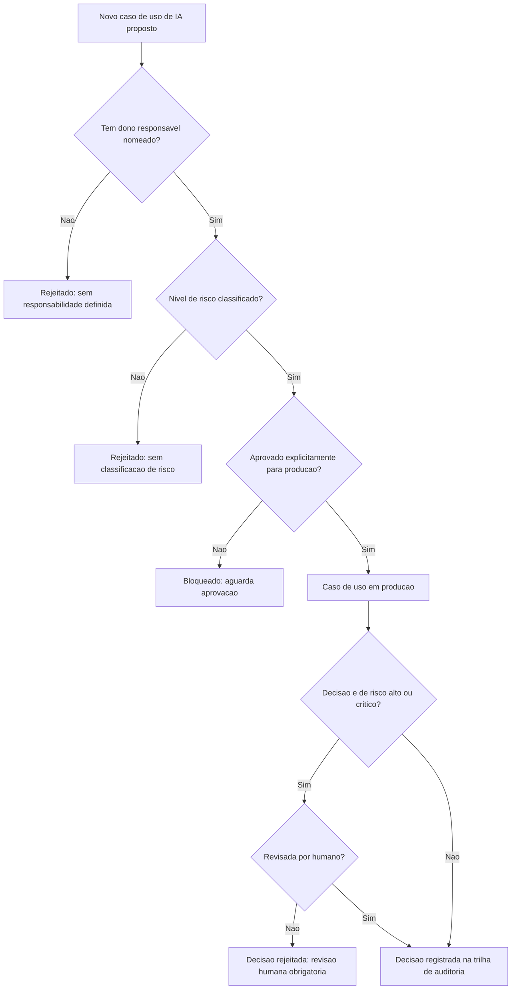

# Diagramas

O fluxo tem dois portões distintos: um antes de o caso de uso entrar em produção (dono,
classificação, aprovação) e outro a cada decisão individual tomada depois (revisão humana quando
o risco exige). Os dois são independentes — um caso de uso aprovado para produção ainda passa
pelo segundo portão a cada decisão de risco alto.

## Matriz de controles

| Controle | Risco mitigado | Como é verificado |
|---|---|---|
| Dono responsável obrigatório por caso de uso | Decisão automatizada sem accountability quando algo dá errado | Teste que rejeita `CasoDeUso` sem `dono_responsavel` |
| Classificação de risco antes de produção | Caso de uso de alto impacto tratado com o mesmo rigor de um trivial | Teste que rejeita produção sem classificação registrada |
| Revisão humana obrigatória para risco alto/crítico | Decisão automatizada de alto impacto sem supervisão humana | Teste que rejeita `DecisaoAutomatizada` de risco alto sem `revisada_por_humano=True` |
| Trilha de auditoria imutável | Decisão automatizada não rastreável depois do fato | Toda decisão aceita é acrescentada a histórico nunca editado |
| Aprovação explícita antes de produção | Caso de uso lançado como efeito colateral de outra funcionalidade | Teste que rejeita produção sem aprovação explícita registrada |
