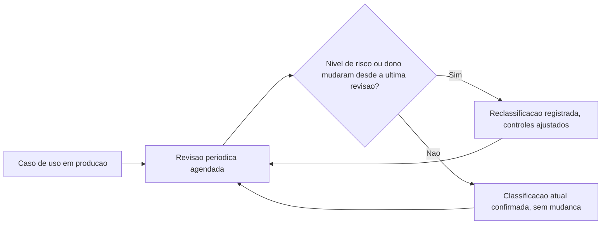

# Fluxogramas

A revisão periódica (G6) nunca é um evento único — mesmo quando nada muda, a confirmação de que
nada mudou é registrada, porque a ausência de revisão periódica é indistinguível, para quem audita
depois, de um caso de uso que mudou de escala ou de impacto sem que ninguém percebesse.

## Por que dono responsável é verificado antes de classificação de risco

O fluxograma principal (`05-Diagramas.md`) verifica dono responsável antes de classificação de
risco, nunca depois — não faz sentido classificar o risco de um caso de uso que nem tem
responsável definido, porque a própria classificação de risco é uma decisão que precisa de um
dono para ser tomada com autoridade. Inverter a ordem produziria uma classificação sem ninguém
formalmente responsável por ela.

A separação entre o fluxo principal (`05-Diagramas.md`, avaliado uma vez por caso de uso e por
decisão) e este fluxo de revisão periódica (avaliado em intervalo recorrente) reflete a diferença
de cadência entre as duas atividades: aprovação e revisão de decisão acontecem no momento certo;
revisão periódica acontece independente de qualquer evento específico, apenas pela passagem do
tempo.

Tratar as duas cadências como se fossem uma só levaria a revisões periódicas disparadas apenas quando algo já deu errado, o que anula o próprio propósito de antecipação da revisão.