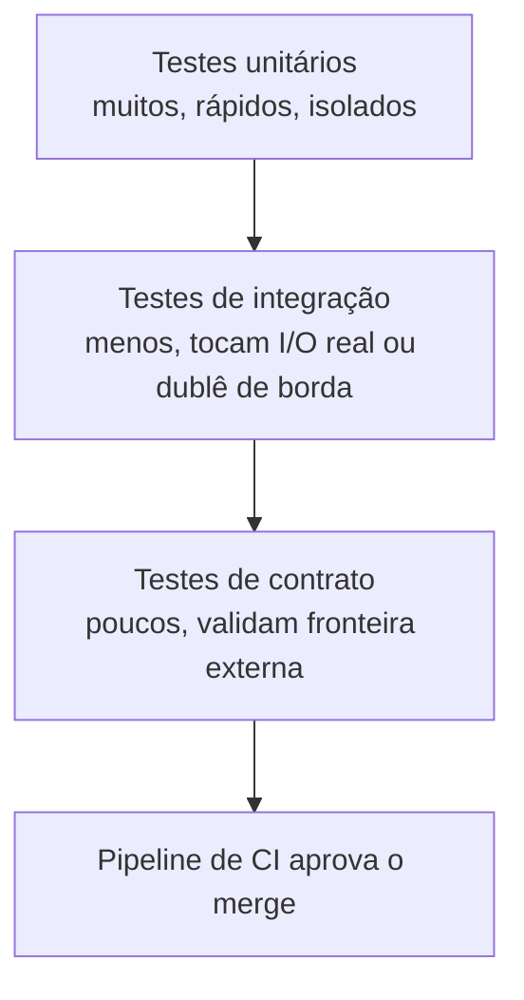

# Arquitetura

Para um `PROCESSO`, "arquitetura" não é topologia de serviço -- é como as camadas de
uma suíte de teste se encaixam e em que ordem o pipeline de integração as executa.
Três camadas, de baixo para cima:

O diagrama mostra a pirâmide de teste como um funil de execução: a base larga (testes
unitários) roda em milissegundos e reprova primeiro, antes que a suíte gaste tempo
subindo para as camadas mais caras. Os três módulos de `exemplos/31-testing/` ficam
inteiramente na base -- `validador_cpf`, `limitador_de_taxa` e `notificacao` são
testados sem tocar rede, disco ou relógio real, e é essa ausência de dependência
externa que os qualifica como unitários, não o fato de testarem "uma função só".
`test_notificador_que_falha_propaga_o_erro`, por exemplo, ainda é unitário: o "erro de
provedor" é simulado por um stub em memória, nunca por uma chamada de rede de verdade.

A segunda vista arquitetural é onde cada peça mora em disco. Código de produção e
módulo de teste vivem em pastas irmãs dentro do mesmo exemplo
(`exemplos/31-testing/validador_cpf.py` e
`exemplos/31-testing/tests/test_validador_cpf.py`), e o `conftest.py` de
`exemplos/31-testing/` é o componente que resolve o import entre as duas sem exigir
pacote instalado -- ver `11-Implementacao.md` para o mecanismo exato. Essa separação
física (produção em um nível, teste em `tests/` um nível abaixo) é o que permite ao
gate 2 da plataforma (`python -m pytest exemplos/31-testing -q`) descobrir e rodar a
suíte inteira sem configuração adicional, e é a mesma convenção que `12-memory` já
adotou -- mecanismo detalhado em `11-Implementacao.md` e dívida técnica original
registrada em `ROADMAP.md` (seção "Dívida técnica registrada").
