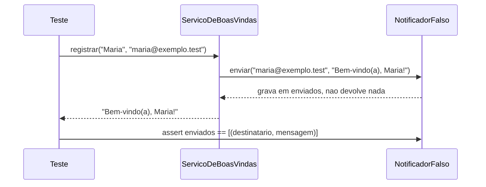
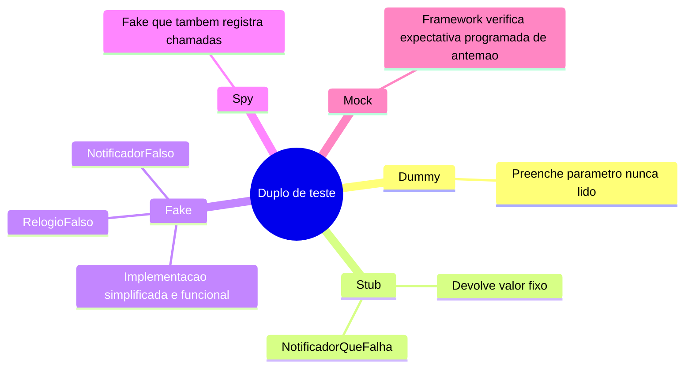

# Diagramas

## Sequência: um teste de interação contra um fake

A sequência mostra por que o teste consegue verificar a interação sem tocar rede: o
fake (`F`) não decide nada, só grava; a asserção final não interroga o serviço (`S`) --
interroga o próprio fake, que é o duplo, sobre o que ele recebeu. Essa é a diferença
entre teste de estado (verificar o valor devolvido, a seta `S-->>T`) e teste de
interação (verificar a chamada recebida, a seta final `T->>F`). Em
`exemplos/31-testing/tests/test_notificacao.py`, os dois tipos aparecem como testes
separados, nunca no mesmo corpo: `test_registrar_devolve_a_mensagem_enviada` só
verifica estado, `test_registrar_envia_mensagem_formatada_ao_destinatario` só verifica
interação -- `13-Testes.md` explica por que separá-los, em vez de somar as duas
asserções numa função só, torna mais fácil saber qual das duas quebrou.

## Mapa mental: a taxonomia de duplo de teste

O mapa ordena os cinco tipos por quanto comportamento cada um simula: um dummy não faz
nada além de existir para satisfazer uma assinatura; um mock, no outro extremo, é
configurado para verificar sozinho se foi chamado como esperado. Os dois duplos deste
volume ficam no meio da escala -- `NotificadorFalso` é um fake que também funciona como
spy (registra chamadas para inspeção posterior), e `NotificadorQueFalha` é um stub puro,
sem estado. Nenhum dos dois módulos usa mock de framework: `09-Boas-Praticas.md` (prática
3) e `10-Anti-Patterns.md` (item 3) explicam por que a interface pequena de
`Notificador` torna isso desnecessário aqui, sem que a ausência de mock signifique que
mock nunca se justifica em outro contexto.
