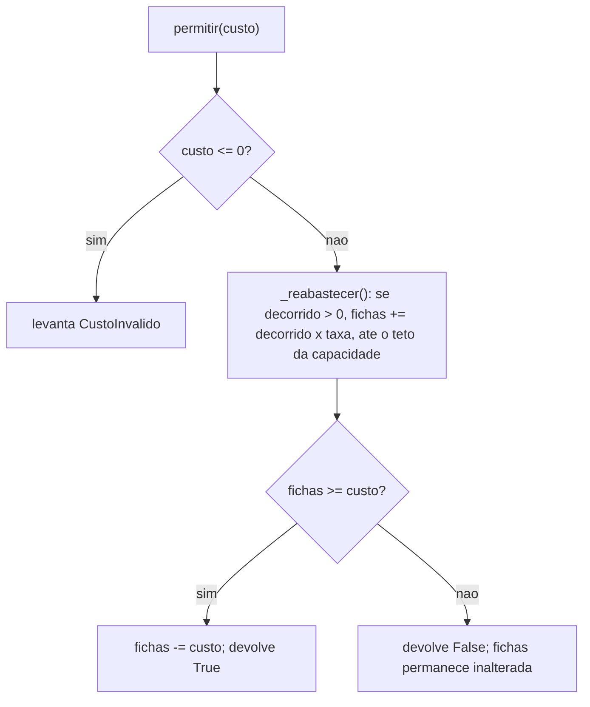
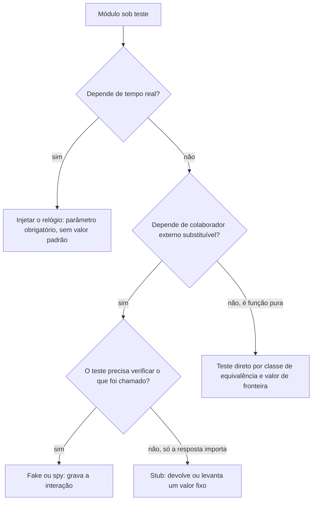

# Fluxogramas

## O caminho de decisão de `LimitadorDeTaxa.permitir`

O fluxo corresponde linha a linha ao corpo de `permitir` em
`exemplos/31-testing/limitador_de_taxa.py`: a checagem de custo vem antes de qualquer
leitura do relógio, porque levantar por parâmetro inválido não deveria depender de
quanto tempo passou desde a última chamada. O ramo `G` é o que
`test_recusa_nao_consome_fichas_parcialmente` trava -- uma recusa não desconta fichas
parcialmente, mesmo que o balde tivesse fichas insuficientes apenas por uma fração do
custo pedido.

## Como decidir que tipo de duplo escrever

Este segundo fluxo é o que decidiu a forma dos três módulos de exemplo, na ordem
inversa à leitura: `validador_cpf` caiu no ramo `H` (função pura, sem colaborador);
`limitador_de_taxa` caiu no ramo `C` (o próprio módulo já nasce com o relógio como
parâmetro obrigatório, não como decisão do teste); `notificacao` caiu nos ramos `F` e
`G` ao mesmo tempo, porque tem um teste de interação (`NotificadorFalso`) e um teste de
propagação de erro (`NotificadorQueFalha`) sobre o mesmo colaborador substituível. Um
módulo real raramente cai em um ramo só -- é comum que partes diferentes da mesma
suíte precisem de duplos diferentes, e forçar todo o módulo a um único tipo de duplo é
o que gera o anti-padrão descrito em `10-Anti-Patterns.md` sob o nome de mock
universal. Os dois fluxogramas desta seção existem para tornar essa decisão explícita
antes da escrita do teste, não depois -- decidir o tipo de duplo depois de já ter
escrito um mock genérico raramente leva a desfazer o trabalho, mesmo quando um fake
mais simples serviria melhor.
