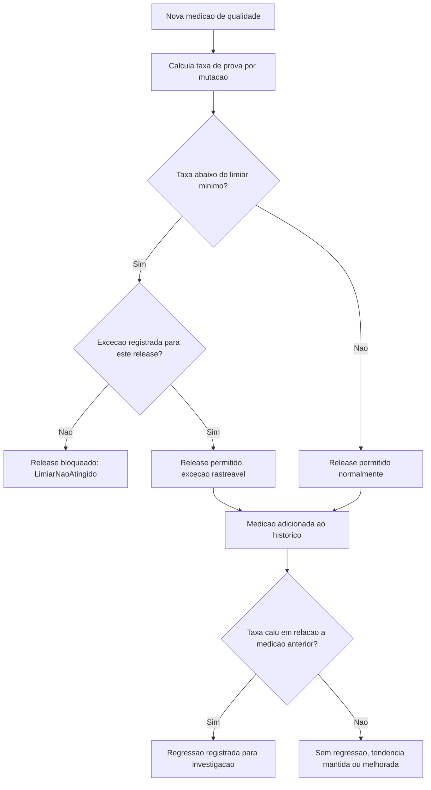

# Diagramas

O gate de release (`C`/`D`/`E`/`F`) e a detecção de regressão (`I`/`J`/`K`) são dois mecanismos
independentes que operam em momentos diferentes — o gate decide se um release específico pode
prosseguir agora; a detecção de regressão compara contra a medição anterior depois que a atual já
foi aceita, servindo para investigação, não para bloqueio imediato.

O nó `B` nunca calcula a taxa a partir de cobertura de linha — apenas a partir da proporção de
regras com prova de mutação registrada, o que é a materialização direta de H1 no próprio fluxo.

A separação visual entre o ramo de gate (decisão imediata) e o ramo de histórico (registro e
análise de tendência) no mesmo fluxograma reforça que os dois mecanismos, embora conectados,
respondem a perguntas diferentes: "posso liberar agora?" contra "a qualidade está piorando?".

Ler o diagrama de cima a baixo já comunica essa distinção antes de qualquer explicação textual complementar ser necessária.

Nenhum outro caminho do diagrama contorna essa ordem específica de verificação, do início ao fim
do fluxo representado, incluindo o ramo de exceção, que ainda assim passa pela mesma checagem
inicial antes de qualquer decisão final de liberar o release ser de fato tomada pelo gate de qualidade.