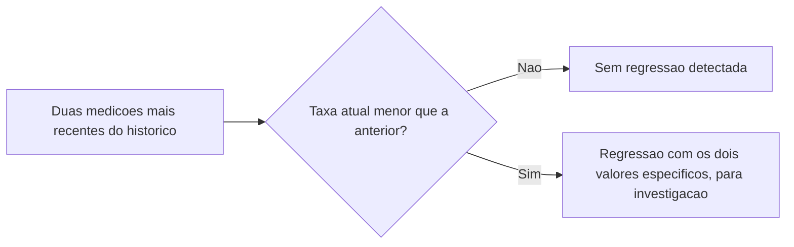

# Fluxogramas

Uma única medição nunca produz uma regressão — o nó `A` sempre precisa de duas medições para
comparar, o que é a materialização de H4: tendência exige mais de um ponto de dado, uma
fotografia isolada não distingue queda real de variação normal entre execuções da suíte.

## Por que a exceção de gate é registrada, não apenas concedida

O caminho `D` do fluxograma principal (`05-Diagramas.md`) — exceção registrada permitindo release
apesar do limiar não atingido — segue a mesma disciplina de exceção rastreável já vista em
`18-DEVSECOPS` (waiver com motivo e prazo): uma exceção sem registro seria indistinguível, para
quem investiga depois, de um gate que simplesmente não estava funcionando.

## Relação com H2

A exceção de gate (H2) e a regressão (H5) não são a mesma coisa: uma exceção concede passagem
apesar do limiar não atingido numa medição específica; uma regressão é a comparação entre duas
medições, independente de qualquer uma delas ter ou não passado no gate. Um release pode passar
no gate normalmente e ainda assim representar uma regressão em relação ao anterior.

Um dashboard que só mostra o resultado do gate, sem também mostrar a tendência de regressão, esconderia justamente esse cenário intermediário mais perigoso.

Reconhecer essa diferença evita o erro de tratar todo release aprovado como sinônimo automático de qualidade estável ao longo do tempo.