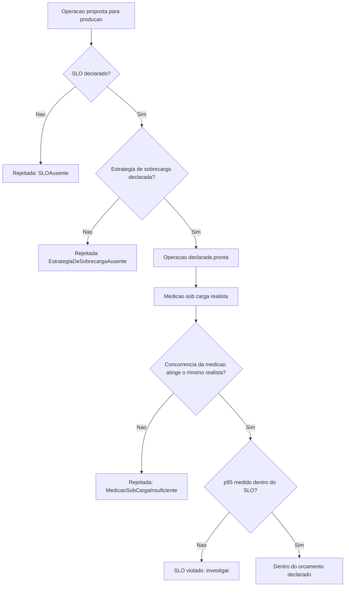

# Diagramas

Os dois portões iniciais (`B`, `D`) acontecem antes de qualquer medição — uma operação sem SLO ou
sem estratégia de sobrecarga declarados nunca chega a ser medida sob carga, porque não há contra o
quê comparar o resultado nem o que fazer se a medição revelar sobrecarga.

O nó `H` (concorrência mínima) garante que uma medição feita sob carga artificialmente baixa nunca
é aceita como prova de que o SLO está sendo respeitado — o mesmo cuidado já visto em H4 do
`32-QUALITY` contra julgar tendência por uma amostra única, aqui aplicado a carga insuficiente.

Nenhum caminho do fluxograma leva a produção sem passar pelos dois portões iniciais — mesmo uma
operação com desempenho excelente esperado nunca entra em produção sem SLO e estratégia de
sobrecarga declarados, independente de quão simples ou trivial ela pareça ser.

Essa ordem estrita reforça, no próprio desenho do fluxo, que declaração vem antes de qualquer medição fazer sentido.

Isso vale mesmo para uma operação que parece trivial de implementar, sem nenhuma exceção aberta
no fluxo representado — o rigor do processo não depende de avaliação subjetiva sobre quão simples
a operação parece ser antes de qualquer medição real de fato acontecer sob carga concorrente.