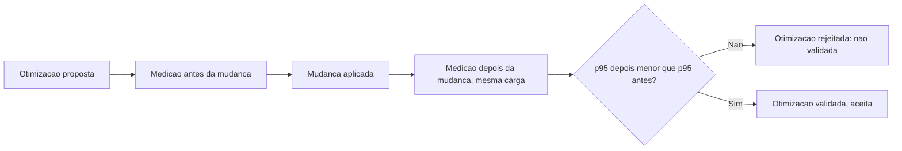

# Fluxogramas

Nenhuma otimização é aceita só porque a mudança "parece" mais rápida na leitura do código — o
fluxo exige uma medição concreta antes e depois, sob a mesma carga, e só a comparação numérica
decide se a otimização de fato funcionou.

## Por que a mesma carga é usada antes e depois

Medir "antes" sob uma carga e "depois" sob outra invalidaria a comparação — a diferença observada
poderia vir da mudança de carga, não da otimização em si. `Otimizacao` carrega as duas medições
junto, e a disciplina de gerar as duas sob a mesma condição de concorrência é o que torna a
comparação do nó `E` significativa.

## Relação com detecção de regressão

Validação de otimização (aqui) e detecção de regressão (`05-Diagramas.md`) são operações
inversas: uma confirma que uma mudança melhorou o p95; a outra confirma que uma mudança piorou o
p95. As duas usam a mesma disciplina de comparação sob carga idêntica, mas respondem perguntas
opostas — uma valida intenção de melhoria, a outra detecta problema não intencional.

Reconhecer essa relação evita duplicar esforço de implementação entre os dois mecanismos, que compartilham a mesma lógica fundamental de comparação de percentil sob carga controlada.

Manter as duas operações conceitualmente separadas, mesmo compartilhando implementação, evita a confusão de tratar toda variação de p95 como um único tipo de evento indiferenciado.