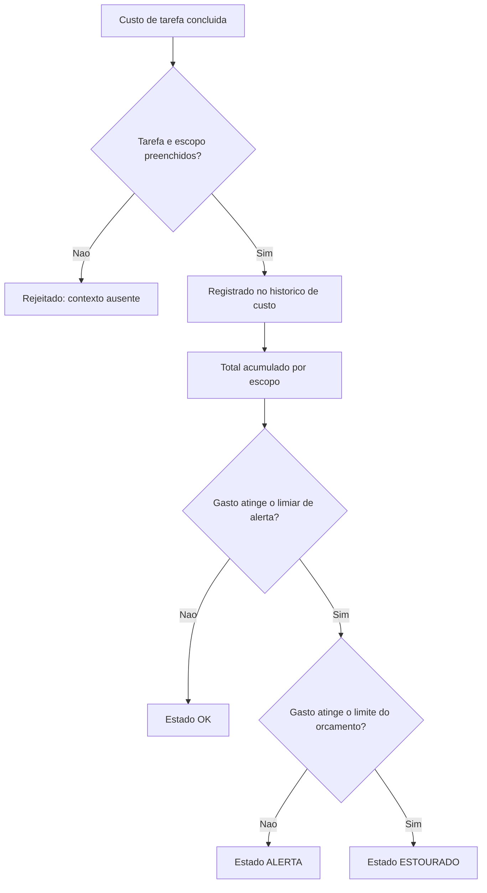

# Diagramas

O estado `ALERTA` existe como degrau intermediário deliberado entre `OK` e `ESTOURADO` — sem
esse degrau, quem acompanha o orçamento só saberia que algo está errado depois que já estivesse
errado, perdendo a janela de reação que o limiar de alerta existe para abrir.

O nó `B` acontece antes de qualquer acúmulo de total — custo sem tarefa ou escopo identificados
nunca contamina o total de nenhum escopo, o que manteria os números de acompanhamento
artificialmente distorcidos por entradas sem contexto suficiente para atribuição correta.

Nenhum caminho do fluxograma permite que um custo sem contexto suficiente contamine o total
acumulado de um escopo — a rejeição no nó `B` acontece antes de qualquer soma, preservando a
integridade dos números usados para decisão de orçamento mais adiante no processo.

Essa ordem de verificação garante que os números usados para decisão de orçamento sempre refletem apenas custo devidamente contextualizado e atribuído.

Nenhum outro caminho do fluxo alcança o total acumulado sem passar por essa checagem inicial, do
começo ao fim do processo representado aqui, incluindo o caminho que leva ao estado ESTOURADO
mais crítico do orçamento, que continua exigindo a mesma checagem prévia de contexto completo
antes de qualquer soma ser sequer considerada válida.