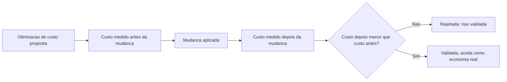

# Fluxogramas

Nenhuma mudança é aceita como economia de custo só porque parece mais barata na intuição de quem
a propõe — o fluxo exige medição concreta antes e depois, e só a diferença numérica decide se a
mudança de fato reduziu o gasto real observado.

## Relação com tendência de custo

`detectar_tendencia_de_custo` e a validação de otimização deste fluxograma respondem perguntas
diferentes: a primeira compara períodos consecutivos de gasto normal ao longo do tempo; a segunda
compara uma medição isolada antes e depois de uma mudança específica intencional. Confundir as
duas levaria a atribuir uma variação normal de tendência a uma otimização que na verdade não
causou nada, ou o contrário.

## Por que a mesma disciplina de comparação aparece em três volumes

A estrutura de "medição antes, mudança aplicada, medição depois, comparação numérica" aparece de
forma quase idêntica em `32-QUALITY` (H5), `33-PERFORMANCE` (J5) e aqui (U5) — não por
coincidência, mas porque as três dimensões compartilham o mesmo problema: uma melhoria não
validada por medição é apenas uma suposição confortável, independente de qual eixo está sendo
medido.

Reconhecer esse padrão recorrente ajuda a aplicar a mesma disciplina rapidamente a uma quarta dimensão futura, caso o acervo venha a precisar de mais uma.

Essa consistência entre volumes não é coincidência de redação, é reflexo de um princípio genuinamente comum aos três domínios diferentes.