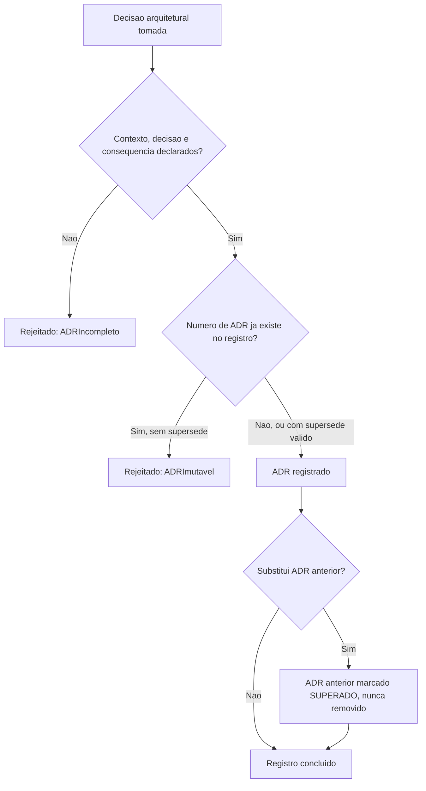

# Diagramas

O nó `D` é a materialização de W2 — nenhum caminho do fluxo permite reescrever um ADR já
registrado sob o mesmo número; a única forma de mudar uma decisão é o caminho explícito de
substituição, que preserva o registro anterior como `SUPERADO` em vez de apagá-lo.

## Matriz de controles

| Controle | Risco mitigado | Como é verificado |
|---|---|---|
| ADR obrigatório com contexto, decisão e consequência | Decisão arquitetural sem registro, reconstruída de memória meses depois | Teste que rejeita `ADR` com qualquer campo vazio |
| Imutabilidade de ADR aceito | Reescrita de decisão apagando o contexto que a motivou originalmente | Teste que rejeita registrar duas vezes sob o mesmo número sem `substituir` |
| Documento versionado junto do código | Documentação desconectada do histórico de mudança que descreve | Teste que rejeita `Documento` com `versionado_junto_do_codigo=False` |
| Vigência de documento verificada explicitamente | Documento desatualizado tratado como se ainda fosse verdadeiro | `verificar_vigencia` levanta exceção nomeada quando uma afirmação não é mais verdadeira |
| Conteúdo gerado nunca editado manualmente | Edição manual sobrescrita silenciosamente na próxima geração, criando falsa confiança | Teste que rejeita `editar_documento` sobre documento marcado `gerado_automaticamente` |

A matriz de controles, exigida para volume de tipo GOVERNANCA, espelha a mesma estrutura já usada
em `17-SECURITY` e `30-AI-GOVERNANCE` — cada controle nomeado, o risco específico que mitiga, e
como a verificação acontece na prática, tornando a governança deste volume auditável da mesma
forma que as governanças técnica e organizacional já estabelecidas em outros volumes deste
acervo.